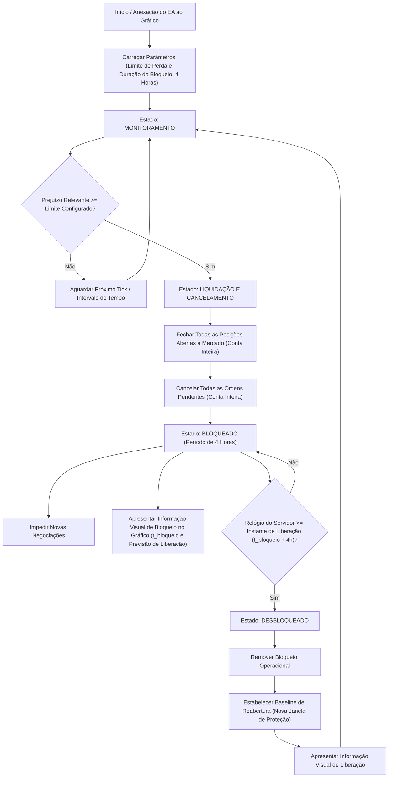

# 01 — Visão Geral do Produto

O **EddyTrader** é um Expert Advisor (EA) para **MetaTrader 5 (MT5)** projetado para atuar exclusivamente como um **Gerenciador de Perda Diária** (*Daily Loss Manager*).

---

## 1. O Que É

O EddyTrader é um mecanismo de segurança operacional de execução local e contínua dentro do terminal MetaTrader 5. Ele atua como uma salvaguarda automatizada, monitorando a evolução do resultado financeiro da conta do usuário durante a sessão diária e executando medidas defensivas imediatas caso o teto de perda aceitável seja alcançado ou superado.

O software opera com foco monocrático: **contenção de risco intradiário**.

---

## 2. Para Quem Existe

O produto destina-se a:

* **Operadores Manuais (Day Traders):** que desejam impor disciplina operacional a si mesmos, eliminando o risco de colapso emocional (*tilt*) e negociações compulsivas de recuperação.
* **Operadores Quantitativos / Híbridos:** que executam múltiplos robôs ou operações discricionárias e exigem uma camada de controle de risco independente de suas estratégias de entrada.
* **Contas de Treinamento e Produção:** usuários operando tanto em ambiente de simulação (**Conta Demo**) quanto com capital real (**Conta Real**).

---

## 3. Problema Resolvido

A ausência de uma trava técnica de perda diária expõe o operador a:

* **Perdas descontroladas:** continuação das negociações após sucessivas operações negativas.
* **Overtrading:** aumento desproporcional no número de ordens com o objetivo de reaver o capital perdido no mesmo dia.
* **Devolução de lucros ou ruína de conta:** dilapidação do patrimônio construído em meses por incapacidade de parar em um único dia adverso.

O EddyTrader resolve esse problema transferindo o poder de interrupção operacional para um algoritmo desprovido de hesitação, fadiga ou viés psicológico.

---

## 4. Fluxo Conceitual

O ciclo de vida operacional do EddyTrader segue um fluxo contínuo e estrito baseado no horário oficial do servidor:

---

## 5. Entradas Principais e Regras Temporais

O produto opera com os seguintes parâmetros normativos:

1. **Limite Máximo de Perda Diária (`Daily Loss Limit`):**
   * Valor numérico monetário positivo (ex: `500.00`).
   * Expressa a quantidade monetária máxima (na moeda da conta) que o operador aceita perder no dia.
2. **Tempo de Bloqueio Operacional:**
   * Duração contínua e relativa de **4 horas** a partir do instante exato de disparo da proteção ($t_{\text{unlock}} = t_{\text{bloqueio}} + 4\text{h}$) no relógio do servidor de negociação.
   * *(Nota: Substitui a interpretação preliminar de horário fixo absoluto diário)*.

---

## 6. Saídas Principais

Quando acionado, o EddyTrader gera as seguintes saídas e efeitos colaterais no ambiente MT5:

* **Ordens Comerciais de Fechamento:** ordens de fechamento a mercado para liquidar toda e qualquer posição aberta na conta.
* **Ordens Comerciais de Cancelamento:** requisições de cancelamento para todas as ordens pendentes (*Buy Limit*, *Sell Limit*, *Buy Stop*, *Sell Stop*, etc.) ativas na conta.
* **Imposição de Bloqueio:** impedimento de novas negociações durante a vigência do período de 4 horas.
* **Apresentação Visual em Gráfico:** renderização de informações textuais claras diretamente no gráfico (HUD/Chart Comment) informando:
  * Motivo do bloqueio (limite atingido);
  * Posições e ordens processadas;
  * Instante do acionamento e horário do servidor estipulado para retorno/liberação ($t_{\text{bloqueio}} + 4\text{h}$).
* **Registro em Log Local:** mensagens estruturadas no Diário (*Journal*) do MetaTrader 5 para fins de auditoria e rastreabilidade temporal.

---

## 7. Estados Principais do Sistema

Conceitualmente, o sistema transita entre quatro estados essenciais:

| Estado | Descrição | Comportamento Operacional |
| :--- | :--- | :--- |
| **`MONITORING`** | Estado nominal padrão de vigilância. | Lê continuamente o resultado da conta e compara com o limite de perda da janela ativa. Permite operações normais. |
| **`LIQUIDATING`** | Estado transitório de contenção de emergência. | Disparado imediatamente quando o limite é atingido. Executa fechamento de posições e cancelamento de ordens pendentes. |
| **`BLOCKED`** | Estado de bloqueio ativo e proteção. | Impede ativamente novas operações e exibe aviso visual durante o período contínuo de 4 horas ($[t_{\text{bloqueio}}, t_{\text{bloqueio}} + 4\text{h})$). |
| **`UNLOCKED`** | Estado transitório de liberação. | Remove as restrições de bloqueio, estabelece a baseline de reabertura para evitar falso rebloqueio e retorna ao estado `MONITORING`. |

---

## 8. Relação com o MetaTrader 5

O EddyTrader opera nativamente dentro da infraestrutura do MetaTrader 5:

* **Formato:** compilado exclusivamente como arquivo executável MQL5 (`.ex5`) derivado de código-fonte MQL5 (`.mq5`).
* **Instalação:** anexado a uma janela de gráfico (*chart*) de qualquer ativo financeiro disponível no terminal.
* **Ciclo de Eventos:** acionado pelos eventos nativos da plataforma, tais como `OnInit()`, `OnDeinit()`, `OnTick()`, `OnTimer()`, e eventos de negociação como `OnTrade()` / `OnTradeTransaction()`.
* **Subordinação à Corretora e Terminal:** toda ação de fechamento ou cancelamento está sujeita às regras da corretora (horário de negociação do símbolo, liquidez, requisições aceitas, modo de margem Hedging vs. Netting).

---

## 9. Rastreabilidade Documental

* Origem: Especificação funcional aprovada (Contexto do Produto e Requisitos Funcionais).
* Detalhamento de Fronteiras: [02 — Escopo e Limites](file:///C:/Projetos/eddytrader/docs/02-ESCOPO-E-LIMITES.md)
* Detalhamento de Requisitos: [03 — Requisitos](file:///C:/Projetos/eddytrader/docs/03-REQUISITOS.md)
* Regras Normativas: [05 — Regras de Negócio](file:///C:/Projetos/eddytrader/docs/05-REGRAS-DE-NEGOCIO.md)
* Arquitetura de Estados: [06 — Arquitetura Conceitual](file:///C:/Projetos/eddytrader/docs/06-ARQUITETURA-CONCEITUAL.md)
* Decisões Arquiteturais: [ADR 0001](file:///C:/Projetos/eddytrader/docs/adr/0001-regras-temporais-e-janelas-de-protecao.md) e [ADR 0002](file:///C:/Projetos/eddytrader/docs/adr/0002-composicao-da-perda-operacional.md)
