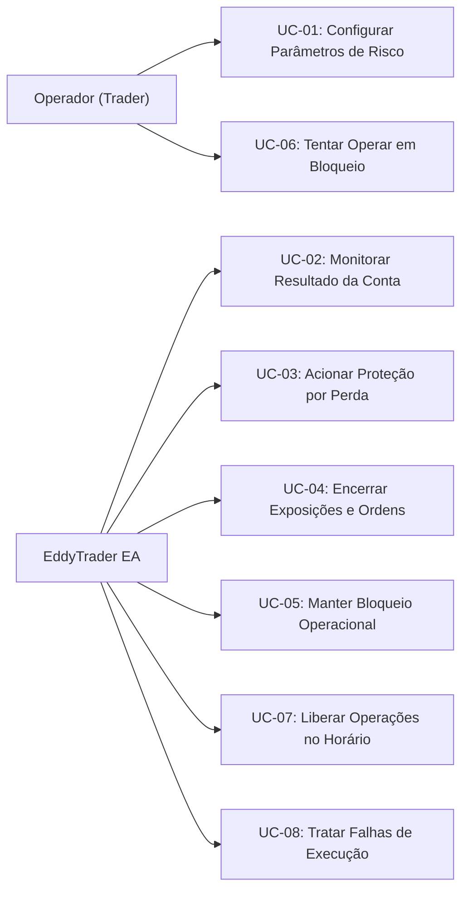

# 04 — Casos de Uso do Sistema

Este documento especifica os Casos de Uso (UC) do **EddyTrader**, detalhando a interação entre os atores envolvidos, as condições de disparo, os fluxos de sucesso e as rotinas de contingência.

---

## 1. Atores do Sistema

* **Operador (Trader):** Usuário humano que anexa o EA ao gráfico, configura os parâmetros de risco e realiza suas operações na conta.
* **Sistema (EddyTrader EA):** Lógica executável em MQL5 em execução contínua no terminal MetaTrader 5.
* **Terminal MetaTrader 5 / Servidor da Corretora:** Infraestrutura de execução que processa ordens, posições e dados de mercado e tempo.

---

## 2. Relação de Casos de Uso

---

## 3. Especificação Detalhada dos Casos de Uso

---

### UC-01 — Configurar Parâmetros de Risco

* **Ator Principal:** Operador.
* **Objetivo:** Estabelecer o valor monetário da perda máxima tolerada e o horário para liberação das operações.
* **Pré-condições:** Terminal MetaTrader 5 em execução com o gráfico aberto.
* **Gatilho:** O operador anexa o EddyTrader a um gráfico ou abre as propriedades do EA (`F7`).
* **Fluxo Principal:**
  1. O operador visualiza a janela de parâmetros de entrada (*Inputs*) do EA.
  2. O operador informa o valor do limite máximo de perda diária (ex: `500.00`).
  3. O operador informa o horário de desbloqueio (ex: `16:00`).
  4. O operador confirma as configurações pressionando "OK".
  5. O sistema valida os valores fornecidos.
  6. O sistema inicializa em estado `MONITORING`, exibindo os parâmetros ativos no gráfico e no log.
* **Exceções:**
  * **E1 — Limite de perda inválido (<= 0):** O sistema alerta no log/gráfico sobre parâmetro inválido e impede a inicialização ou assume estado de alerta seguro sem habilitar proteção incoerente.
  * **E2 — Formato de horário inválido:** O sistema alerta erro de formato e solicita correção.
* **Pós-condições:** Parâmetros carregados na memória do EA e prontos para monitoramento.
* **Requisitos Relacionados:** [RF-001](file:///C:/Projetos/eddytrader/docs/03-REQUISITOS.md#rf-001), [RF-002](file:///C:/Projetos/eddytrader/docs/03-REQUISITOS.md#rf-002), [RNF-004](file:///C:/Projetos/eddytrader/docs/03-REQUISITOS.md#rnf-004).

---

### UC-02 — Monitorar Resultado da Conta

* **Ator Principal:** Sistema (EddyTrader EA).
* **Objetivo:** Acompanhar de forma ininterrupta o resultado realizado e flutuante relevante da conta.
* **Pré-condições:** EA inicializado com sucesso em estado `MONITORING`.
* **Gatilho:** Recepção de novo tick no gráfico (`OnTick`) ou disparo de ciclo temporizado (`OnTimer`).
* **Fluxo Principal:**
  1. O sistema consulta as transações e negócios encerrados no período considerado do dia.
  2. O sistema calcula a soma do resultado financeiro realizado.
  3. O sistema varre todas as posições abertas na conta e lê o lucro/prejuízo flutuante consolidado.
  4. O sistema calcula o prejuízo acumulado relevante.
  5. O sistema compara o valor apurado com o limite de perda configurado.
  6. Se o prejuízo for menor que o limite, o sistema atualiza as métricas no gráfico e permanece no estado `MONITORING`.
* **Exceções:**
  * **E1 — Histórico de negócios temporariamente indisponível:** O sistema registra aviso no log e retenta na próxima iteração sem alterar estado indevidamente.
* **Pós-condições:** Nível de exposição e perda diária recalculados e atualizados.
* **Requisitos Relacionados:** [RF-003](file:///C:/Projetos/eddytrader/docs/03-REQUISITOS.md#rf-003), [RF-004](file:///C:/Projetos/eddytrader/docs/03-REQUISITOS.md#rf-004), [RNF-003](file:///C:/Projetos/eddytrader/docs/03-REQUISITOS.md#rnf-003), [RNF-006](file:///C:/Projetos/eddytrader/docs/03-REQUISITOS.md#rnf-006).

---

### UC-03 — Acionar Proteção por Perda

* **Ator Principal:** Sistema (EddyTrader EA).
* **Objetivo:** Detectar a violação da regra de perda máxima e dar início imediato ao protocolo de emergência.
* **Pré-condições:** Sistema em estado `MONITORING`.
* **Gatilho:** O prejuízo apurado no ciclo de monitoramento torna-se igual ou superior ao limite diário (ex: perda acumulada de R$ 503,00 para limite de R$ 500,00).
* **Fluxo Principal:**
  1. O sistema identifica que a condição de limite foi violada.
  2. O sistema registra em log o evento de violação contendo: saldo, perda realizada, flutuante, limite e horário exato.
  3. O sistema transita imediatamente para o estado transitório de liquidação (`LIQUIDATING`).
  4. O sistema invoca imediatamente o encerramento de exposições ([UC-04](file:///C:/Projetos/eddytrader/docs/04-CASOS-DE-USO.md#uc-04--encerrar-exposicoes-e-ordens)).
* **Exceções:** Nenhuma. A violação exige disparo incondicional.
* **Pós-condições:** Sistema em modo de contenção ativo (`LIQUIDATING`).
* **Requisitos Relacionados:** [RF-005](file:///C:/Projetos/eddytrader/docs/03-REQUISITOS.md#rf-005), [RNF-004](file:///C:/Projetos/eddytrader/docs/03-REQUISITOS.md#rnf-004), [RNF-005](file:///C:/Projetos/eddytrader/docs/03-REQUISITOS.md#rnf-005).

---

### UC-04 — Encerrar Exposições e Ordens

* **Ator Principal:** Sistema (EddyTrader EA).
* **Objetivo:** Fechar todas as posições abertas e cancelar todas as ordens pendentes na conta.
* **Pré-condições:** Sistema em estado `LIQUIDATING`.
* **Gatilho:** Disparo efetuado por [UC-03](file:///C:/Projetos/eddytrader/docs/04-CASOS-DE-USO.md#uc-03--acionar-protecao-por-perda).
* **Fluxo Principal:**
  1. O sistema enumera todas as posições atualmente abertas na conta.
  2. Para cada posição, o sistema emite uma requisição de fechamento a mercado (`TRADE_ACTION_DEAL`).
  3. O sistema enumera todas as ordens pendentes da conta.
  4. Para cada ordem pendente, o sistema emite uma requisição de cancelamento (`TRADE_ACTION_REMOVE`).
  5. O sistema confirma o processamento das ordens e posições.
  6. O sistema transita para o estado `BLOCKED` ([UC-05](file:///C:/Projetos/eddytrader/docs/04-CASOS-DE-USO.md#uc-05--manter-bloqueio-operacional)).
* **Exceções:**
  * **E1 — Falha no encerramento de posição específica:** Tratada em [UC-08](file:///C:/Projetos/eddytrader/docs/04-CASOS-DE-USO.md#uc-08--tratar-falhas-de-execucao).
* **Pós-condições:** Posições abertas encerradas, ordens pendentes removidas e transição para o estado `BLOCKED`.
* **Requisitos Relacionados:** [RF-006](file:///C:/Projetos/eddytrader/docs/03-REQUISITOS.md#rf-006), [RF-007](file:///C:/Projetos/eddytrader/docs/03-REQUISITOS.md#rf-007), [RF-013](file:///C:/Projetos/eddytrader/docs/03-REQUISITOS.md#rf-013).

---

### UC-05 — Manter Bloqueio Operacional

* **Ator Principal:** Sistema (EddyTrader EA).
* **Objetivo:** Garantir que novas operações não permaneçam ativas durante a vigência do bloqueio e manter o operador informado.
* **Pré-condições:** Conclusão da liquidação em [UC-04](file:///C:/Projetos/eddytrader/docs/04-CASOS-DE-USO.md#uc-04--encerrar-exposicoes-e-ordens).
* **Gatilho:** Entrada no estado `BLOCKED`.
* **Fluxo Principal:**
  1. O sistema atualiza a interface visual no gráfico com mensagem contendo:
     * Alerta explícito de que o limite de perda foi atingido.
     * Confirmação de que todas as operações foram encerradas.
     * Declaração de bloqueio de novas operações.
     * Horário estipulado para a liberação.
  2. O sistema permanece em vigilância estrita.
  3. A cada verificação temporal, compara o horário atual com o horário de desbloqueio configurado.
  4. Enquanto o horário atual for menor que o horário de liberação, mantém o estado `BLOCKED`.
* **Exceções:**
  * **E1 — Detecção de nova ordem/posição durante o bloqueio:** Caso nova ordem ou posição seja detectada durante o bloqueio, o sistema atua imediatamente para neutralizá-la (ver questão arquitetural em [06-ARQUITETURA-CONCEITUAL.md](file:///C:/Projetos/eddytrader/docs/06-ARQUITETURA-CONCEITUAL.md)).
* **Pós-condições:** Operações impedidas e interface do gráfico informando o bloqueio ativo.
* **Requisitos Relacionados:** [RF-008](file:///C:/Projetos/eddytrader/docs/03-REQUISITOS.md#rf-008), [RF-009](file:///C:/Projetos/eddytrader/docs/03-REQUISITOS.md#rf-009).

---

### UC-06 — Tentar Operar em Bloqueio

* **Ator Principal:** Operador (ou outro EA).
* **Objetivo:** Tentar abrir nova posição enquanto a proteção diária estiver ativa.
* **Pré-condições:** Sistema em estado `BLOCKED`.
* **Gatilho:** O operador envia uma ordem manual ou outro robô emite uma ordem na conta.
* **Fluxo Principal:**
  1. A tentativa de operação ocorre durante o período de bloqueio.
  2. O sistema identifica a nova operação ou tentativa.
  3. O sistema impede ou neutraliza a operação imediatamente, conforme capacidade técnica da plataforma MT5.
  4. O sistema registra a violação da regra de bloqueio no diário do MT5.
  5. O estado `BLOCKED` e o aviso visual permanecem ativos.
* **Exceções:** Falhas técnicas de rejeição por mercado fechado tratadas em [UC-08](file:///C:/Projetos/eddytrader/docs/04-CASOS-DE-USO.md#uc-08--tratar-falhas-de-execucao).
* **Pós-condições:** Conta preservada sem novas posições ativas.
* **Requisitos Relacionados:** [RF-008](file:///C:/Projetos/eddytrader/docs/03-REQUISITOS.md#rf-008), [RNF-004](file:///C:/Projetos/eddytrader/docs/03-REQUISITOS.md#rnf-004).

---

### UC-07 — Liberar Operações no Horário

* **Ator Principal:** Sistema (EddyTrader EA).
* **Objetivo:** Desarmar o bloqueio operacional e retornar a conta ao estado de vigilância regular.
* **Pré-condições:** Sistema em estado `BLOCKED`.
* **Gatilho:** O horário do terminal/servidor atinge ou ultrapassa o horário de desbloqueio configurado.
* **Fluxo Principal:**
  1. O sistema detecta que o horário atual coincide ou superou o horário de desbloqueio.
  2. O sistema registra o evento de liberação no log do terminal.
  3. O sistema atualiza o gráfico com a mensagem: *"Bloqueio removido. Operações liberadas."*.
  4. O sistema remove as travas de bloqueio.
  5. O sistema transita para o estado `MONITORING`.
  6. O monitoramento contínuo continua normalmente ([UC-02](file:///C:/Projetos/eddytrader/docs/04-CASOS-DE-USO.md#uc-02--monitorar-resultado-da-conta)).
* **Exceções:** Nenhuma.
* **Pós-condições:** Sistema liberado e monitorando ativamente.
* **Requisitos Relacionados:** [RF-010](file:///C:/Projetos/eddytrader/docs/03-REQUISITOS.md#rf-010), [RF-011](file:///C:/Projetos/eddytrader/docs/03-REQUISITOS.md#rf-011), [RF-012](file:///C:/Projetos/eddytrader/docs/03-REQUISITOS.md#rf-012).

---

### UC-08 — Tratar Falhas de Execução

* **Ator Principal:** Sistema (EddyTrader EA).
* **Objetivo:** Assegurar que falhas parciais ou recusas da corretora não travem o EA nem impeçam o encerramento das demais posições.
* **Pré-condições:** Tentativa de fechamento ou cancelamento de ordem/posição rejeitada pelo servidor da corretora.
* **Gatilho:** Retorno de erro comercial (ex: requote, mercado fechado, sem liquidez, preço alterado) durante [UC-04](file:///C:/Projetos/eddytrader/docs/04-CASOS-DE-USO.md#uc-04--encerrar-exposicoes-e-ordens).
* **Fluxo Principal:**
  1. A chamada de fechamento/cancelamento retorna código de erro (`retcode != TRADE_RETCODE_DONE`).
  2. O sistema captura o código e a mensagem de erro da plataforma.
  3. O sistema registra detalhadamente no log a falha, o ticket da posição/ordem e o motivo retornado.
  4. O sistema prossegue para a próxima posição ou ordem pendente da lista, sem abortar a rotina.
  5. Caso restem pendências não encerradas, o sistema mantém tentativas programadas seguras.
  6. O EA permanece ativo e íntegro.
* **Exceções:** Falha generalizada de conexão com o terminal (o sistema tenta novamente assim que a conexão retornar).
* **Pós-condições:** Falha devidamente auditada no Diário e demais posições processadas.
* **Requisitos Relacionados:** [RF-013](file:///C:/Projetos/eddytrader/docs/03-REQUISITOS.md#rf-013), [RNF-004](file:///C:/Projetos/eddytrader/docs/03-REQUISITOS.md#rnf-004), [RNF-005](file:///C:/Projetos/eddytrader/docs/03-REQUISITOS.md#rnf-005).
