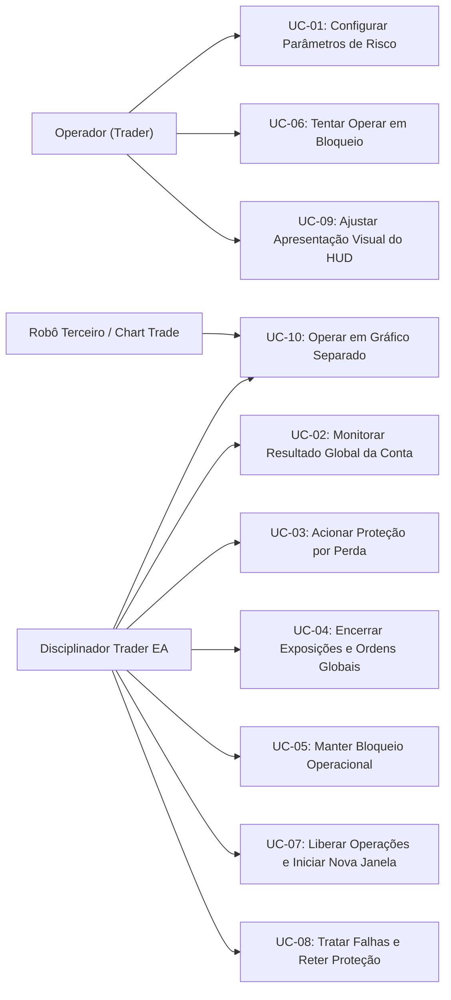

# 04 — Casos de Uso do Sistema

Este documento especifica os Casos de Uso (UC) do **Disciplinador Trader** (nome de projeto interno: **EddyTrader**), detalhando os fluxos operacionais, regras de tempo do servidor, bloqueio contínuo de 4 horas, convivência account-global em gráficos separados (RF-015), controle adaptativo do HUD e contingência de falhas.

---

## 1. Atores do Sistema

* **Operador (Trader):** Usuário que anexa o EA ao gráfico, define os parâmetros de risco, controla a visualização do HUD e realiza suas operações na conta (no mesmo gráfico ou em gráficos separados).
* **Robô Operacional Terceiro (EA Externo):** Algoritmo comercial de execução anexado a outro gráfico na mesma conta.
* **Sistema (Disciplinador Trader EA):** Instância única em MQL5 em execução contínua no terminal MetaTrader 5 (Gráfico B).
* **Servidor de Negociação da Corretora:** Infraestrutura da corretora que fornece o relógio oficial do sistema (`TimeCurrent`), executa requisições e mantém o histórico contábil.

---

## 2. Relação de Casos de Uso

---

## 3. Especificação Detalhada dos Casos de Uso

---

### UC-01 — Configurar Parâmetros de Risco

* **Ator Principal:** Operador.
* **Objetivo:** Estabelecer o limite monetário diário de perda e inicializar o sistema com o tempo de bloqueio de 4 horas aprovado.
* **Pré-condições:** Terminal MT5 em execução com gráfico aberto.
* **Gatilho:** O operador anexa o Disciplinador Trader a um gráfico ou abre suas propriedades (`F7`).
* **Fluxo Principal:**
  1. O operador visualiza os parâmetros de entrada (*Inputs*).
  2. O operador informa o valor do limite máximo de perda diária (ex: `500.00`).
  3. O sistema adota a duração normativa aprovada de 4 horas contínuas de bloqueio a partir do instante do disparo ($t_{\text{unlock}} = t_{\text{bloqueio}} + 4\text{h}$). *(Nota: A menção preliminar a horário fixo absoluto diário foi formalmente corrigida por esclarecimento de requisito do PO)*.
  4. O operador confirma as configurações pressionando "OK".
  5. O sistema valida os valores fornecidos ($L > 0$).
  6. O sistema inicializa em estado `MONITORING`, exibindo o limite de perda, o status operacional e o relógio oficial do servidor no gráfico.
* **Exceções:**
  * **E1 — Parâmetro inválido:** Limite $\le 0$ emite alerta no Diário e impede a ativação da proteção em modo inconsistente.
* **Pós-condições:** Parâmetros carregados e prontos para monitoramento sob o relógio do servidor.
* **Requisitos Relacionados:** [RF-001](file:///C:/Projetos/eddytrader/docs/03-REQUISITOS.md#rf-001), [RF-002](file:///C:/Projetos/eddytrader/docs/03-REQUISITOS.md#rf-002), [RN-001](file:///C:/Projetos/eddytrader/docs/05-REGRAS-DE-NEGOCIO.md#rn-001), [ADR 0001](file:///C:/Projetos/eddytrader/docs/adr/0001-regras-temporais-e-janelas-de-protecao.md).

---

### UC-02 — Monitorar Resultado da Conta

* **Ator Principal:** Sistema (Disciplinador Trader EA).
* **Objetivo:** Acompanhar de forma ininterrupta o resultado realizado do dia operacional e o resultado flutuante atual da conta.
* **Pré-condições:** EA inicializado com sucesso em estado `MONITORING`.
* **Gatilho:** Novo tick de mercado (`OnTick`) ou temporizador de alta frequência (`OnTimer`).
* **Fluxo Principal:**
  1. O sistema obtém o horário atual do servidor da corretora.
  2. O sistema totaliza os negócios fechados no intervalo de `00:00:00` até o horário corrente do servidor, incluindo lucros/prejuízos brutos, comissões e swaps.
  3. O sistema ignora qualquer transação de depósito, saque ou ajuste financeiro não oriundo de negociação.
  4. O sistema varre todas as posições abertas na conta (incluindo posições carregadas de dias anteriores) e obtém o flutuante líquido atual.
  5. O sistema calcula o resultado diário $D(t) = R_{\text{day}}(t) + F(t)$ e o resultado da janela ativa $W_n(t) = D(t) - B_n$ (com $B_0 = 0$ na primeira janela e $B_n = D(t_{\text{reopen}, n})$ após desbloqueios, conforme [10-ESPECIFICACAO-MATEMATICA.md](file:///C:/Projetos/eddytrader/docs/10-ESPECIFICACAO-MATEMATICA.md)).
  6. O sistema compara o valor com o limite de perda ($W_n(t) \le -L$). Se não houver violação, atualiza o gráfico e permanece em `MONITORING`.
* **Exceções:**
  * **E1 — Falha transitória na consulta do histórico:** O sistema retenta no próximo evento sem corromper o estado atual.
* **Pós-condições:** Métrica de perda da janela atualizada com precisão líquida real.
* **Requisitos Relacionados:** [RF-003](file:///C:/Projetos/eddytrader/docs/03-REQUISITOS.md#rf-003), [RF-004](file:///C:/Projetos/eddytrader/docs/03-REQUISITOS.md#rf-004), [RN-002](file:///C:/Projetos/eddytrader/docs/05-REGRAS-DE-NEGOCIO.md#rn-002), [ADR 0002](file:///C:/Projetos/eddytrader/docs/adr/0002-composicao-da-perda-operacional.md), [ADR 0003](file:///C:/Projetos/eddytrader/docs/adr/0003-modelo-matematico-de-janelas-e-baseline.md).

---

### UC-03 — Acionar Proteção por Perda

* **Ator Principal:** Sistema (Disciplinador Trader EA).
* **Objetivo:** Reconhecer a violação da perda máxima e disparar compulsoriamente a liquidação e o cálculo da janela de 4 horas de bloqueio.
* **Pré-condições:** Sistema em estado `MONITORING`.
* **Gatilho:** O resultado da janela operacional ativa atinge ou supera o limite monetário ($W_n(t) \le -L$).
* **Fluxo Principal:**
  1. O sistema atesta que $W_n(t) \le -L$ (ou equivalentemente, $P_n(t) \ge L$).
  2. O sistema carimba o instante oficial de acionamento da proteção no relógio do servidor:
     $$T_0 = t_{\text{trigger}} = t$$
  3. O sistema define a janela temporal contínua de bloqueio de 4 horas:
     $$T_{\text{unlock}} = T_0 + 4\text{h} = t_{\text{trigger}} + 14.400\text{s}$$
     O sistema deve permanecer no estado bloqueado no intervalo:
     $$[t_{\text{trigger}}, t_{\text{unlock}})$$
     e tornar-se elegível à liberação quando:
     $$t \ge t_{\text{unlock}}$$
  4. O sistema registra o evento de disparo no Diário do MT5 detalhando $t_{\text{trigger}}$ e $t_{\text{unlock}}$.
  5. O sistema transita para o estado transitório `LIQUIDATING` e inicia [UC-04](file:///C:/Projetos/eddytrader/docs/04-CASOS-DE-USO.md#uc-04--encerrar-exposicoes-e-ordens).
* **Pós-condições:** Sistema em modo de contenção ativo (`LIQUIDATING`) com janela temporal $[t_{\text{trigger}}, t_{\text{unlock}})$ formalizada.
* **Requisitos Relacionados:** [RF-005](file:///C:/Projetos/eddytrader/docs/03-REQUISITOS.md#rf-005), [RN-003](file:///C:/Projetos/eddytrader/docs/05-REGRAS-DE-NEGOCIO.md#rn-003), [ADR 0001](file:///C:/Projetos/eddytrader/docs/adr/0001-regras-temporais-e-janelas-de-protecao.md), [ADR 0003](file:///C:/Projetos/eddytrader/docs/adr/0003-modelo-matematico-de-janelas-e-baseline.md).

---

### UC-04 — Encerrar Exposições e Ordens

* **Ator Principal:** Sistema (Disciplinador Trader EA).
* **Objetivo:** Fechar todas as posições abertas e cancelar todas as ordens pendentes em escopo global da conta.
* **Pré-condições:** Sistema em estado `LIQUIDATING`.
* **Gatilho:** Disparo efetuado por [UC-03](file:///C:/Projetos/eddytrader/docs/04-CASOS-DE-USO.md#uc-03--acionar-protecao-por-perda).
* **Fluxo Principal:**
  1. O sistema varre 100% das posições abertas na conta (todos os símbolos e robôs).
  2. Para cada posição, emite ordem de fechamento a mercado.
  3. O sistema varre 100% das ordens pendentes na conta.
  4. Para cada ordem pendente, emite solicitação de cancelamento.
  5. Se todas as posições forem encerradas e ordens canceladas, o sistema transita para `BLOCKED` ([UC-05](file:///C:/Projetos/eddytrader/docs/04-CASOS-DE-USO.md#uc-05--manter-bloqueio-operacional)).
* **Exceções:**
  * **E1 — Falha no fechamento de uma posição individual:** Aciona [UC-08](file:///C:/Projetos/eddytrader/docs/04-CASOS-DE-USO.md#uc-08--tratar-falhas-e-reter-protecao).
* **Pós-condições:** Conta limpa e desfeita de exposições; sistema no estado `BLOCKED`.
* **Requisitos Relacionados:** [RF-006](file:///C:/Projetos/eddytrader/docs/03-REQUISITOS.md#rf-006), [RF-007](file:///C:/Projetos/eddytrader/docs/03-REQUISITOS.md#rf-007), [RN-004](file:///C:/Projetos/eddytrader/docs/05-REGRAS-DE-NEGOCIO.md#rn-004), [RN-005](file:///C:/Projetos/eddytrader/docs/05-REGRAS-DE-NEGOCIO.md#rn-005).

---

### UC-05 — Manter Bloqueio Operacional

* **Ator Principal:** Sistema (Disciplinador Trader EA).
* **Objetivo:** Manter a proteção ativa, impedir novas operações e gerenciar a transição temporal até a liberação após 4 horas.
* **Pré-condições:** Conclusão da liquidação em [UC-04](file:///C:/Projetos/eddytrader/docs/04-CASOS-DE-USO.md#uc-04--encerrar-exposicoes-e-ordens).
* **Gatilho:** Entrada no estado `BLOCKED`.
* **Fluxo Principal:**
  1. O sistema renderiza mensagem no gráfico informando:
     * Limite de perda violado;
     * Operações encerradas;
     * Bloqueio ativo;
     * Horário do servidor em que ocorreu o bloqueio ($T_0$);
     * Data e horário do servidor previstos para a liberação ($T_{\text{unlock}} = T_0 + 4\text{h}$).
  2. O sistema acompanha continuamente o relógio do servidor dentro do intervalo $[T_0, T_{\text{unlock}})$.
  3. **Comportamento na virada de dia:** A passagem de `00:00:00` não interfere na duração. Mesmo que um novo dia operacional comece enquanto o bloqueio estiver ativo, o bloqueio continua ininterruptamente até completar as 4 horas (ex: bloqueio às 23:30 permanece até 03:30 do dia seguinte).
  4. Enquanto o relógio do servidor satisfizer $T < T_{\text{unlock}}$, o bloqueio prevalece de forma irrestrita.
* **Exceções:**
  * **E1 — Tentativa de operação durante o bloqueio:** Processada em [UC-06](file:///C:/Projetos/eddytrader/docs/04-CASOS-DE-USO.md#uc-06--tentar-operar-em-bloqueio).
* **Pós-condições:** Bloqueio mantido até o instante oficial programado ($T \ge T_{\text{unlock}}$).
* **Requisitos Relacionados:** [RF-008](file:///C:/Projetos/eddytrader/docs/03-REQUISITOS.md#rf-008), [RF-009](file:///C:/Projetos/eddytrader/docs/03-REQUISITOS.md#rf-009), [RF-010](file:///C:/Projetos/eddytrader/docs/03-REQUISITOS.md#rf-010), [RN-006](file:///C:/Projetos/eddytrader/docs/05-REGRAS-DE-NEGOCIO.md#rn-006), [RN-007](file:///C:/Projetos/eddytrader/docs/05-REGRAS-DE-NEGOCIO.md#rn-007), [ADR 0001](file:///C:/Projetos/eddytrader/docs/adr/0001-regras-temporais-e-janelas-de-protecao.md).

---

### UC-06 — Tentar Operar em Bloqueio

* **Ator Principal:** Operador (ou outro robô na conta).
* **Objetivo:** Tentar abrir ordem ou posição durante vigência do bloqueio de 4 horas.
* **Pré-condições:** Sistema no estado `BLOCKED` ($T \in [T_0, T_{\text{unlock}})$).
* **Gatilho:** Submissão de ordem manual ou automática.
* **Fluxo Principal:**
  1. Uma nova ordem ou posição surge na conta durante o bloqueio.
  2. O sistema detecta a presença da ordem ou posição.
  3. O sistema neutraliza ou fecha a operação imediatamente.
  4. O sistema registra o evento de violação de bloqueio no Diário.
  5. O estado `BLOCKED` permanece ativo.
* **Pós-condições:** Conta preservada sem novas posições ativas.
* **Requisitos Relacionados:** [RF-008](file:///C:/Projetos/eddytrader/docs/03-REQUISITOS.md#rf-008), [RN-006](file:///C:/Projetos/eddytrader/docs/05-REGRAS-DE-NEGOCIO.md#rn-006).

---

### UC-07 — Liberar Operações e Iniciar Nova Janela

* **Ator Principal:** Sistema (Disciplinador Trader EA).
* **Objetivo:** Desarmar a proteção temporal após completadas as 4 horas, permitir novas negociações e iniciar uma nova janela de monitoramento intradiário.
* **Pré-condições:** Sistema no estado `BLOCKED`.
* **Gatilho:** O relógio oficial do servidor alcança o término do bloqueio temporal de 4 horas ($t \ge t_{\text{unlock}}$, com $t_{\text{unlock}} = t_{\text{trigger}} + 14.400\text{s}$) e todas as condições de segurança são satisfeitas no instante de reabertura ($t_{\text{reopen}} \ge t_{\text{unlock}}$).
* **Fluxo Principal:**
  1. O sistema constata que transcorreram pelo menos 4 horas contínuas desde o bloqueio ($t \ge t_{\text{unlock}}$) e que não restam pendências operacionais ativas.
  2. O sistema registra no Diário do MT5 a remoção do bloqueio.
  3. O sistema atualiza o comentário do gráfico: *"Bloqueio removido. Operações liberadas."*.
  4. O sistema encerra o evento de proteção anterior e **estabelece a `baseline_de_reabertura`** para a nova janela operacional $J_n$ no instante efetivo da reabertura ($B_n = D(t_{\text{reopen}, n})$).
  5. O sistema remove as travas de bloqueio e transita para `MONITORING`.
  6. O resultado da nova janela inicia em $W_n(t_{\text{reopen}, n}) = D(t_{\text{reopen}, n}) - B_n = 0$, prevenindo falso rebloqueio imediato.
  7. Novas perdas a partir da liberação passam a ser monitoradas frente ao limite configurado ($W_n(t) \le -L$).
* **Pós-condições:** Operações permitidas; nova janela operacional ativa com baseline estabelecida.
* **Requisitos Relacionados:** [RF-010](file:///C:/Projetos/eddytrader/docs/03-REQUISITOS.md#rf-010), [RF-011](file:///C:/Projetos/eddytrader/docs/03-REQUISITOS.md#rf-011), [RF-012](file:///C:/Projetos/eddytrader/docs/03-REQUISITOS.md#rf-012), [RN-007](file:///C:/Projetos/eddytrader/docs/05-REGRAS-DE-NEGOCIO.md#rn-007), [RN-008](file:///C:/Projetos/eddytrader/docs/05-REGRAS-DE-NEGOCIO.md#rn-008), [10-ESPECIFICACAO-MATEMATICA.md](file:///C:/Projetos/eddytrader/docs/10-ESPECIFICACAO-MATEMATICA.md), [11-MAQUINA-DE-ESTADOS.md](file:///C:/Projetos/eddytrader/docs/11-MAQUINA-DE-ESTADOS.md), [ADR 0001](file:///C:/Projetos/eddytrader/docs/adr/0001-regras-temporais-e-janelas-de-protecao.md), [ADR 0003](file:///C:/Projetos/eddytrader/docs/adr/0003-modelo-matematico-de-janelas-e-baseline.md), [ADR 0004](file:///C:/Projetos/eddytrader/docs/adr/0004-maquina-de-estados-e-recuperacao.md).

---

### UC-08 — Tratar Falhas e Reter Proteção

* **Ator Principal:** Sistema (Disciplinador Trader EA).
* **Objetivo:** Isolar erros pontuais de corretora sem abortar o EA e reter o estado de proteção enquanto houver posições não encerradas.
* **Pré-condições:** Rejeição ou recusa da corretora ao tentar fechar posição ou cancelar ordem pendente.
* **Gatilho:** Retorno de código de erro comercial (`retcode != TRADE_RETCODE_DONE`).
* **Fluxo Principal:**
  1. O sistema captura o erro, código de retorno e ticket da operação.
  2. O sistema registra a falha com detalhes no Diário do terminal.
  3. O sistema prossegue na varredura das demais posições e ordens pendentes.
  4. **Se ao final do ciclo restarem posições abertas não encerradas, o sistema NÃO retorna ao estado nominal de monitoramento (`MONITORING`), permanecendo em estado de contingência/proteção ativa.**
  5. O EA programa novas tentativas de fechamento nos próximos ciclos.
* **Pós-condições:** Falhas auditadas, posições viáveis encerradas e estado defensivo retido até resolução das pendências.
* **Requisitos Relacionados:** [RF-013](file:///C:/Projetos/eddytrader/docs/03-REQUISITOS.md#rf-013), [RN-009](file:///C:/Projetos/eddytrader/docs/05-REGRAS-DE-NEGOCIO.md#rn-009), [11-MAQUINA-DE-ESTADOS.md](file:///C:/Projetos/eddytrader/docs/11-MAQUINA-DE-ESTADOS.md), [ADR 0004](file:///C:/Projetos/eddytrader/docs/adr/0004-maquina-de-estados-e-recuperacao.md), Decisão D16.

---

### UC-09 — Ajustar Apresentação Visual do HUD (Minimizar / Maximizar)

* **Ator Principal:** Operador.
* **Objetivo:** Alternar a densidade de apresentação visual do HUD no gráfico entre os modos Expandido (Compacto ou Detalhado) e Minimizado (pill discreta), preservando a legibilidade gráfica e as preferências do operador sem afetar o motor de risco.
* **Pré-condições:** Disciplinador Trader ativo com HUD visível.
* **Gatilho:** Clique do mouse no botão de controle de visualização (`[ — MINIMIZAR ]` ou `[ + ]`).
* **Fluxo Principal (Minimizar):**
  1. O operador clica no botão `[ — MINIMIZAR ]` presente no painel Compacto ou Detalhado.
  2. O sistema registra o modo expandido atual (`COMPACT` ou `DETAILED`) na variável de memória `g_last_expanded_hud_mode`.
  3. O sistema altera o estado do painel para `PANEL_COLLAPSED`.
  4. O sistema destrói os elementos gráficos expandidos e renderiza a pill minimizada (dimensões compactas $370 \times 26$ px) contendo: título curto `DISCIPLINADOR`, status operacional resumido, perda diária atual, limite e botão de expansão `[ + ]`.
  5. O sistema persiste a preferência visual na variável global do terminal `EDDY_<LOGIN>_CONFIG_PANEL_COLLAPSED = 1.0` de forma não-fatal (desacoplada de $\mathbf{D}_{\text{min\_recovery}}$).
* **Fluxo Alternativo (Maximizar):**
  1. O operador clica no botão `[ + ]` na pill minimizada.
  2. O sistema altera o estado do painel para `PANEL_EXPANDED`.
  3. O sistema restaura com precisão o modo expandido previamente ativo (`COMPACT` ou `DETAILED`).
  4. O sistema persiste a preferência visual `EDDY_<LOGIN>_CONFIG_PANEL_COLLAPSED = 0.0`.
* **Fluxo durante Bloqueio:**
  * Se o sistema transitar para `BLOCKED` ou `LIQUIDATING` enquanto minimizado, a pill exibe visualmente `🔒 BLOQUEADO hh:mm:ss` com borda e texto em cor de destaque (amarelo/vermelho), garantindo consciência de proteção sem expandir forçosamente o painel sobre a visão do trader.
* **Pós-condições:** Apresentação visual ajustada de forma ergonômica; estado do motor de risco e da FSM operacional rigorosamente preservados.
* **Requisitos Relacionados:** [RF-014](file:///C:/Projetos/eddytrader/docs/03-REQUISITOS.md#rf-014), [RN-010](file:///C:/Projetos/eddytrader/docs/05-REGRAS-DE-NEGOCIO.md#rn-010).

---

### UC-10 — Coexistir com Execução Manual e EAs Terceiros em Gráficos Separados

* **Ator Principal:** Operador / EA Terceiro.
* **Objetivo:** Permitir ao operador negociar livremente no Gráfico A (manualmente via boletas de clique rápido/Chart Trade ou através de robôs de estratégia comercial com seus próprios Magic Numbers), mantendo o Disciplinador Trader isolado no Gráfico B como guardião global de integridade da conta.
* **Pré-condições:** Disciplinador Trader anexado ao Gráfico B em estado `MONITORING`.
* **Gatilho:** Execução de ordens de compra/venda no Gráfico A pelo operador ou EA terceiro.
* **Fluxo Principal:**
  1. O operador (ou EA terceiro) emite ordens a mercado ou pendentes no Gráfico A (ex: no mini-índice WIN com Magic 777001).
  2. O Disciplinador Trader (no Gráfico B, ex: EURUSD) detecta as posições e o impacto financeiro global na conta via eventos transacionais `OnTradeTransaction` e varredura de `AccountInfoDouble(ACCOUNT_PROFIT)`.
  3. As ordens e operações fluem livremente enquanto o resultado financeiro total estiver estritamente dentro do limite de perda permitido ($W_n(t) > -L$).
  4. Caso as operações do Gráfico A atinjam o limite de perda estabelecido ($W_n(t) \le -L$), o Disciplinador Trader (Gráfico B) assume compulsoriamente a liquidação:
     * Encerra a mercado todas as posições abertas no Gráfico A (e em qualquer outro ativo da conta), independente de Magic Number.
     * Cancela todas as ordens pendentes em todos os ativos da conta.
     * Entra em estado de bloqueio `BLOCKED` de 4 horas para a conta inteira.
* **Pós-condições:** Disciplina de conta rigorosamente garantida sem conflito de gráficos ou interferência nos canais de envio de ordens comerciais.
* **Requisitos Relacionados:** [RF-015](file:///C:/Projetos/eddytrader/docs/03-REQUISITOS.md#rf-015), [RN-004](file:///C:/Projetos/eddytrader/docs/05-REGRAS-DE-NEGOCIO.md#rn-004), [RN-005](file:///C:/Projetos/eddytrader/docs/05-REGRAS-DE-NEGOCIO.md#rn-005).
