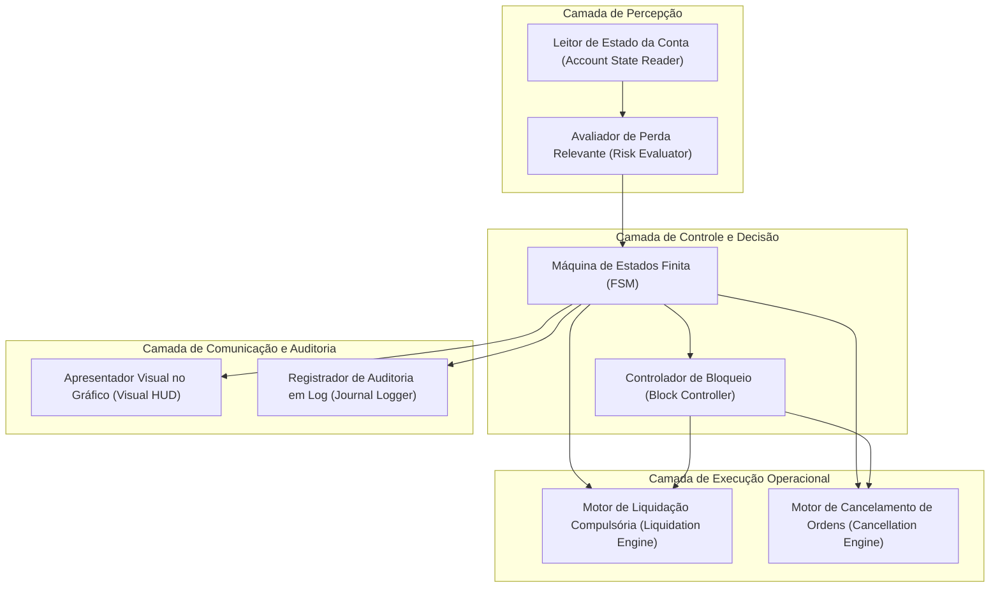
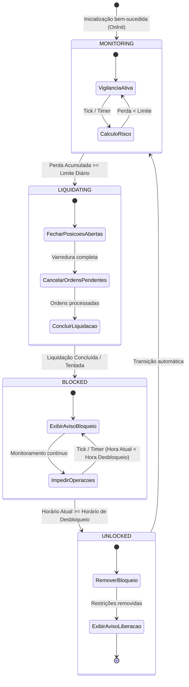
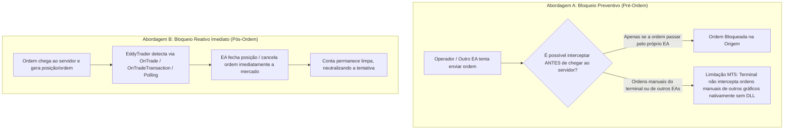

# 06 — Arquitetura Conceitual do EddyTrader

Este documento define a arquitetura conceitual e os blocos de responsabilidade do **EddyTrader**. Este documento é estritamente conceitual e normativo: **não define nem antecipa implementações de código MQL5 executável**.

---

## 1. Princípios Arquiteturais

A arquitetura conceitual do EddyTrader é orientada por três diretrizes:

1. **Responsabilidade Única e Mínima:** Cada componente conceitual possui uma única atribuição delimitada.
2. **Determinismo e Isolamento:** Todas as transições operacionais ocorrem através de uma Máquina de Estados Finita (FSM) explícita.
3. **Nativismo MQL5:** Todos os blocos conceituais operam estritamente sobre as interfaces nativas do runtime do MetaTrader 5.

---

## 2. Decomposição Conceitual de Responsabilidades

O sistema decompõe-se funcionalmente em sete módulos conceituais:

### 2.1. Leitor de Estado da Conta (*Account State Reader*)
* **Responsabilidade:** Consultar os dados brutos da conta no terminal MT5: histórico de negociações do período, posições abertas atuais e ordens pendentes.
* **Escopo:** Leitura pura, sem efeitos colaterais.

### 2.2. Avaliador de Perda Relevante (*Risk Evaluator*)
* **Responsabilidade:** Consolidar o resultado realizado e o flutuante conforme a regra de negócio [RN-002](file:///C:/Projetos/eddytrader/docs/05-REGRAS-DE-NEGOCIO.md#rn-002) e calcular a distância até o limite máximo configurado.
* **Saída:** Indicador booleano de violação de risco (`Limite Excedido: Sim/Não`).

### 2.3. Máquina de Estados Finita (*FSM - Finite State Machine*)
* **Responsabilidade:** Orquestrar o estado global da proteção, garantindo que as ações executivas ocorram apenas mediante transições de estado válidas.
* **Saída:** Estado corrente do sistema e gatilhos de transição.

### 2.4. Motor de Liquidação Compulsória (*Liquidation Engine*)
* **Responsabilidade:** Varrer as posições abertas e emitir ordens de fechamento a mercado.
* **Resiliência:** Em caso de erro em uma posição individual, registra no log e continua o processamento das demais ([RN-009](file:///C:/Projetos/eddytrader/docs/05-REGRAS-DE-NEGOCIO.md#rn-009)).

### 2.5. Motor de Cancelamento de Ordens (*Cancellation Engine*)
* **Responsabilidade:** Varrer as ordens pendentes na conta e emitir solicitações de remoção/cancelamento.

### 2.6. Controlador de Bloqueio (*Block Controller*)
* **Responsabilidade:** Assegurar a manutenção do bloqueio operacional durante o período estipulado e disparar o desbloqueio no horário configurado.

### 2.7. Apresentador Visual e Logger (*Visual HUD & Journal Logger*)
* **Responsabilidade:** Renderizar no gráfico as mensagens oficiais de estado e auditoria de cada ação no Diário do MT5.

---

## 3. Máquina de Estados Conceitual

O ciclo de vida operacional é modelado através de quatro estados formais:

### 3.1. Detalhamento dos Estados

* **`MONITORING` (Monitoramento Nominal):**
  * O EA avalia periodicamente o resultado financeiro.
  * O operador pode abrir e gerenciar suas ordens livremente.
  * O gráfico exibe status de monitoramento ativo.
* **`LIQUIDATING` (Liquidação Transitória de Emergência):**
  * Disparado quando a perda atinge ou supera o teto configurado.
  * O EA emite comandos de fechamento e cancelamento imediatos.
  * Transita compulsoriamente para `BLOCKED` ao concluir a varredura.
* **`BLOCKED` (Bloqueio Ativo de Proteção):**
  * O EA exibe mensagem oficial de bloqueio no gráfico.
  * Novas ordens são impedidas ou neutralizadas.
  * Permanece neste estado até a correspondência de horário.
* **`UNLOCKED` (Desbloqueio e Liberação):**
  * Estado de transição disparado quando o horário atual iguala ou ultrapassa o horário de desbloqueio.
  * O bloqueio é desativado, mensagem visual de liberação é apresentada e o sistema reingressa em `MONITORING`.

---

## 4. Questão Arquitetural Crítica: Mecanismo de Bloqueio no MetaTrader 5

O requisito de produto define expressamente:

> **"Após atingir o limite, novas operações devem ser bloqueadas."**

Esta seção estabelece formalmente uma **distinção arquitetural essencial** entre duas abordagens técnicas possíveis dentro do ecossistema do MetaTrader 5, sem adotar previamente nenhuma implementação nesta W01.

### 4.1. Abordagem A: Bloqueio Preventivo (*Pre-Trade Interception*)
* **Conceito:** Impedir que o comando de envio de ordem sequer seja despachado ao servidor da corretora.
* **Viabilidade Técnica no MT5 Puro (MQL5 sem DLLs):**
  * Um EA em MQL5 consegue bloquear ordens que *ele próprio* geraria.
  * **Contudo**, um EA padrão rodando em um gráfico do MT5 **não possui ganchos nativos (*hooks*) no terminal para interceptar o clique manual do operador no botão de negociação a um clique (*One-Click Trading*) ou no diálogo padrão `F9`**, nem para interceptar ordens emitidas por outro EA rodando em outro gráfico antes que cheguem ao servidor, a menos que se utilizem DLLs invasivas (as quais estão formalmente proibidas pelo escopo).
* **Implicação:** O produto não pode prometer impedir fisicamente o clique do usuário sem uso de tecnologias vetadas.

### 4.2. Abordagem B: Bloqueio Reativo Imediato (*Post-Trade Liquidation / Immediate Kill*)
* **Conceito:** O EA mantém vigilância ativa por eventos de negociação (`OnTradeTransaction`, `OnTrade`, e polling em `OnTick` / `OnTimer`). No milissegundo em que uma nova ordem pendente ou posição for identificada durante o estado `BLOCKED`, o EA emite imediatamente uma ordem contrária a mercado para encerrar a posição ou cancela a ordem pendente.
* **Viabilidade Técnica no MT5 Puro:** 100% nativo, seguro, compatível com as regras de MQL5, sem requisição de DLL ou violação de segurança do terminal.
* **Implicação:** Existe uma fração de segundo (tempo de roundtrip com a corretora) entre a abertura e o fechamento compulsório.

### 4.3. Diretriz Normativa da W01
* O requisito de produto permanece integralmente preservado.
* Nenhuma decisão técnica unilateral foi tomada nesta W.
* A resolução entre a Abordagem A (e suas reais limitações na plataforma), a Abordagem B e eventuais configurações de terminal (como desabilitar *AlgoTrading* programaticamente) foi registrada como **[DQ-001](file:///C:/Projetos/eddytrader/docs/08-RISCOS-E-QUESTOES-ABERTAS.md#dq-001--mecanismo-de-bloqueio-operacional-no-mt5)** para resolução via Spike Técnico formal no roadmap.

---

## 5. Rastreabilidade Documental

* Requisitos Associados: [03 — Requisitos](file:///C:/Projetos/eddytrader/docs/03-REQUISITOS.md)
* Casos de Uso Vinculados: [04 — Casos de Uso](file:///C:/Projetos/eddytrader/docs/04-CASOS-DE-USO.md)
* Regras Vinculadas: [05 — Regras de Negócio](file:///C:/Projetos/eddytrader/docs/05-REGRAS-DE-NEGOCIO.md)
* Questões Abertas e Riscos: [08 — Riscos e Questões Abertas](file:///C:/Projetos/eddytrader/docs/08-RISCOS-E-QUESTOES-ABERTAS.md)
* Planejamento de Validação: [09 — Roadmap](file:///C:/Projetos/eddytrader/docs/09-ROADMAP.md)
