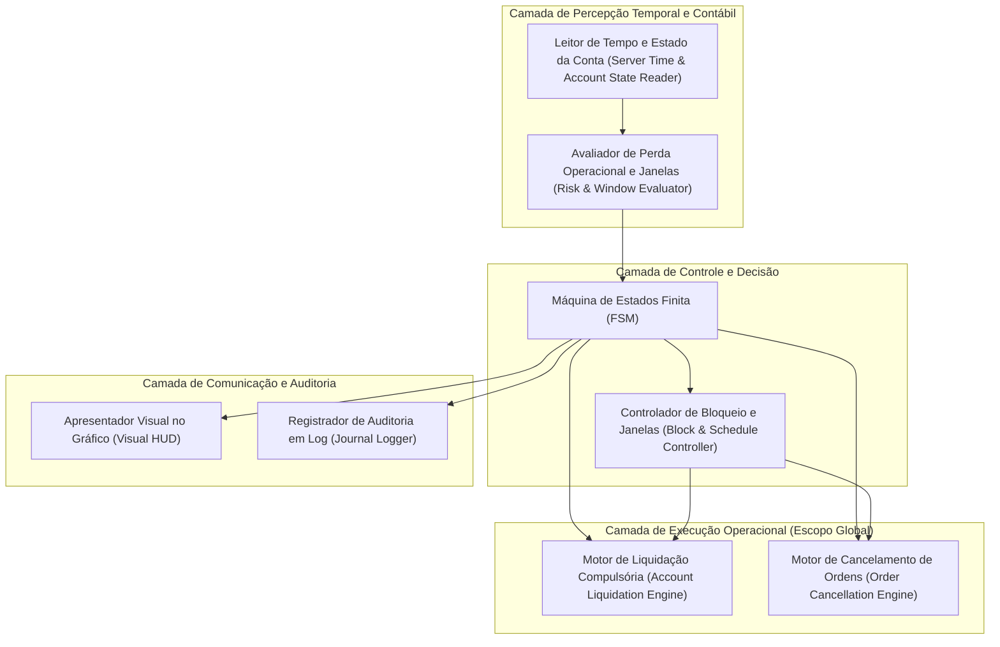
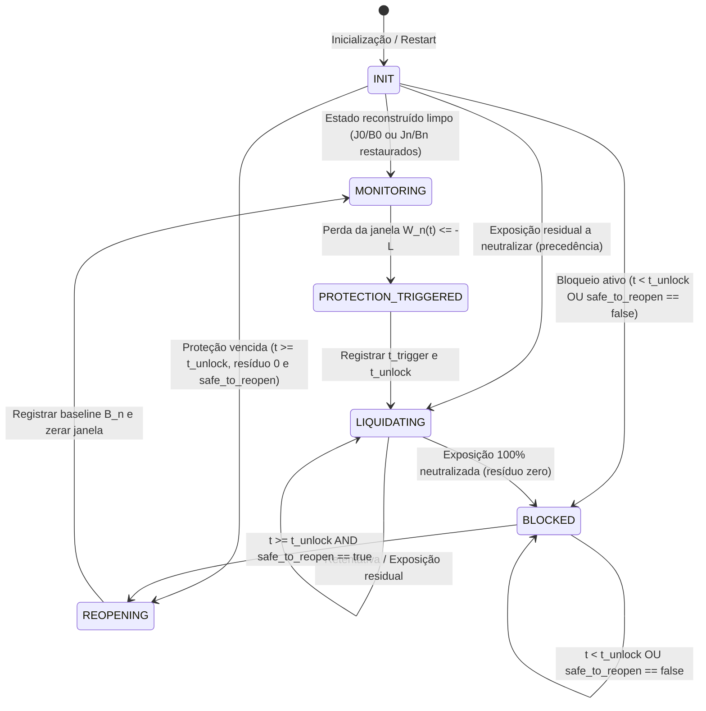
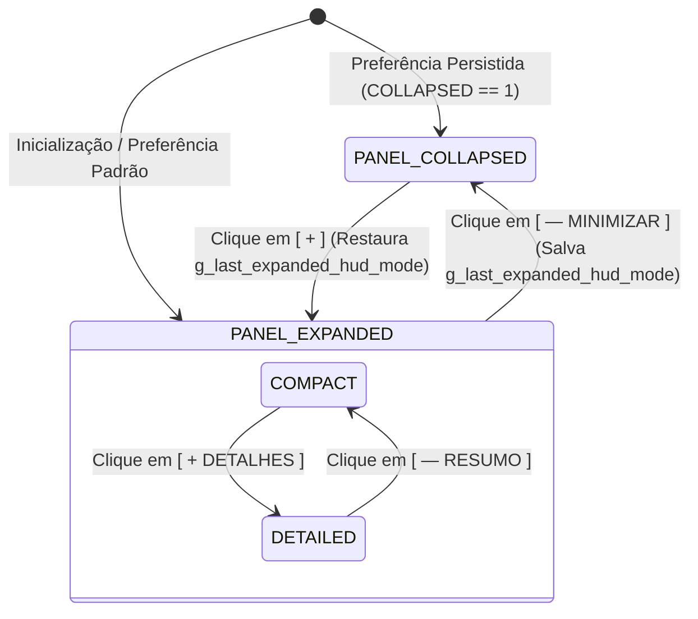

# 06 — Arquitetura Conceitual do Disciplinador Trader

Este documento define a arquitetura conceitual e os blocos de responsabilidade do **Disciplinador Trader** (nome de projeto interno: **EddyTrader**). Este documento é puramente conceitual e normativo, estabelecendo os princípios estruturais da governança account-global e a separação estrita entre a FSM operacional e o estado de apresentação visual.

---

## 1. Princípios Arquiteturais

A arquitetura conceitual do EddyTrader orienta-se por quatro diretrizes:

1. **Responsabilidade Única e Mínima:** Cada módulo conceitual possui uma atribuição estrita e delimitada.
2. **Determinismo e Isolamento:** Todas as transições operacionais ocorrem através de uma Máquina de Estados Finita (FSM) explícita.
3. **Tempo Soberano do Servidor:** Todos os cálculos e janelas temporais operam com base exclusiva no relógio do servidor de negociação da corretora.
4. **Reconstrução Determinística sobre Persistência:** O sistema prioriza a inferência e reconstrução do estado operacional a partir do histórico nativo da conta, evitando arquivos duplicados e estados inconsistentes.

---

## 2. Decomposição Conceitual de Responsabilidades

O sistema estrutura-se conceitualmente em sete módulos funcionais:

### 2.1. Leitor de Tempo e Estado da Conta (*Server Time & Account Reader*)
* **Responsabilidade:** Consultar o relógio do servidor de negociação, varrer o histórico diário (`00:00:00` às `23:59:59` do servidor), filtrar negócios de trading (ignorando depósitos/saques) e ler o flutuante líquido atual.

### 2.2. Avaliador de Perda Operacional e Janelas (*Risk & Window Evaluator*)
* **Responsabilidade:** Calcular o resultado diário consolidado $D(t) = R_{\text{day}}(t) + F(t)$ somando realizado líquido (com comissões e swaps) e flutuante atual, e calcular o resultado da janela ativa $W_n(t) = D(t) - B_n$ (com $B_0 = 0$ e $B_n = D(t_{\text{reopen}, n})$ para $n \ge 1$), confrontando com o limite $L$ segundo [10-ESPECIFICACAO-MATEMATICA.md](file:///C:/Projetos/eddytrader/docs/10-ESPECIFICACAO-MATEMATICA.md).

### 2.3. Máquina de Estados Finita (*FSM - Finite State Machine*)
* **Responsabilidade:** Controlar o ciclo de vida da proteção, governando as transições entre vigilância, contenção, bloqueio programado e liberação.

### 2.4. Motor de Liquidação Compulsória (*Account Liquidation Engine*)
* **Responsabilidade:** Emitir ordens de fechamento a mercado para 100% das posições abertas na conta (todos os símbolos e robôs), isolando falhas individuais sem interromper o processamento das demais.

### 2.5. Motor de Cancelamento de Ordens (*Order Cancellation Engine*)
* **Responsabilidade:** Emitir requisições de remoção para 100% das ordens pendentes existentes na conta.

### 2.6. Controlador de Bloqueio e Janelas (*Block & Schedule Controller*)
* **Responsabilidade:** Gerenciar a janela temporal de bloqueio de 4 horas a partir do acionamento ($t_{\text{unlock}} = t_{\text{trigger}} + 4\text{h}$), retendo o bloqueio após a meia-noite caso a janela atravesse a virada de dia e administrando o gatilho de reabertura de nova janela em $t_{\text{reopen}} \ge t_{\text{unlock}}$.

### 2.7. Apresentador Visual e Logger (*Visual HUD & Journal Logger*)
* **Responsabilidade:** Exibir no gráfico informações claras de status (relógio do servidor, limite, perdas, instante do bloqueio e previsão de liberação após 4h) e auditar eventos com carimbo de tempo do servidor no Diário do MT5.

---

## 3. Máquina de Estados Conceitual

O comportamento operacional do EddyTrader é governado por seis estados conceituais normativos formalizados integralmente em [11 — Máquina de Estados](file:///C:/Projetos/eddytrader/docs/11-MAQUINA-DE-ESTADOS.md):

### 3.1. Transições Críticas Detalhadas

1. **`INIT` $\to$ `MONITORING` / `BLOCKED` / `REOPENING` / `LIQUIDATING`:** Ponto de entrada obrigatório. O sistema inspeciona registros e histórico sob ordem hierárquica estrita:
   * Se dados insuficientes ou baseline intradiária irrecuperável $\implies$ retém em `INIT` (`safe_to_operate = false`, postura *fail-closed* sem fallback para zero);
   * Se houver exposição residual que deveria ter sido eliminada $\implies$ transita para `LIQUIDATING` (precedência absoluta de contenção);
   * Se houver proteção ativa com $t < t_{\text{unlock}}$ e resíduo zero $\implies$ transita para `BLOCKED` preservando $t_{\text{trigger}}$ e $t_{\text{unlock}}$;
   * Se houver proteção pendente com $t \ge t_{\text{unlock}}$ e resíduo zero $\implies$ transita para `BLOCKED` se `safe_to_reopen == false`, ou diretamente para `REOPENING` se `safe_to_reopen == true` (sendo terminantemente proibido pular para `MONITORING`);
   * Se estado for nominal sem proteção pendente $\implies$ transita para `MONITORING` (estabelecendo $B_0 \gets 0$ se primeira janela ou restaurando $B_n$ intradiário).
2. **`MONITORING` $\to$ `PROTECTION_TRIGGERED` $\to$ `LIQUIDATING`:** Disparada imediatamente quando $W_n(t) \le -L$. Congela o contexto, registra $t_{\text{trigger}}$, calcula $t_{\text{unlock}} = t_{\text{trigger}} + 14.400\text{s}$ e comanda a liquidação compulsória integral.
3. **`LIQUIDATING` $\to$ `LIQUIDATING` / `BLOCKED`:** Enquanto existir qualquer posição aberta ou ordem pendente a ser neutralizada, o sistema **permanece estritamente em `LIQUIDATING`**, persistindo nas tentativas de encerramento. A transição para `BLOCKED` ocorre única e exclusivamente após a neutralização de 100% da exposição (resíduo zero). O relógio de 4 horas ($t_{\text{unlock}}$) corre continuamente durante `LIQUIDATING`.
4. **`BLOCKED` $\to$ `REOPENING`:** Ocorre estritamente quando duas condições são simultaneamente satisfeitas: decurso das 4 horas contínuas ($t \ge t_{\text{unlock}}$) e segurança operacional atestada (`safe_to_reopen == true`). A virada de `00:00:00` não cancela o bloqueio.
5. **`REOPENING` $\to$ `MONITORING`:** Encerra formalmente o evento de bloqueio em $t_{\text{reopen}} \ge t_{\text{unlock}}$, estabelece a baseline $B_{n+1} = D(t_{\text{reopen}})$ garantindo $W_{n+1}(t_{\text{reopen}}) = 0$, e reabre o monitoramento contra novas perdas na nova janela.

---

## 4. Máquina de Estados de Apresentação Visual do HUD

A apresentação visual do HUD é governada por uma **Máquina de Estados de Apresentação** independente e estritamente desacoplada da FSM operacional de risco:

### 4.1. Princípios de Desacoplamento Visual
1. **Isolamento de Falha:** Falhas gráficas na criação ou atualização de objetos no gráfico NUNCA afetam o cálculo de risco nem provocam transição para *Fail-Closed*. O motor de risco opera soberanamente mesmo se o HUD falhar.
2. **Preservação Determinística do Modo Expandido:** Quando o usuário minimiza o painel a partir do modo `DETAILED`, o sistema armazena essa escolha (`g_last_expanded_hud_mode`). Ao maximizar novamente através do botão `[ + ]`, o modo `DETAILED` é restaurado com exatidão (o mesmo ocorrendo para `COMPACT`).
3. **Persistência Não-Fatal:** O estado `PANEL_COLLAPSED` é persistido per-account na Global Variable `EDDY_<LOGIN>_CONFIG_PANEL_COLLAPSED`. A persistência visual é segregada e independente do conjunto conceitual $\mathbf{D}_{\text{min\_recovery}}$.

---

## 5. Reconstrução Determinística vs. Persistência em Disco

A decisão arquitetural de produto para o MVP ([D12](file:///C:/Projetos/eddytrader/docs/adr/0001-regras-temporais-e-janelas-de-protecao.md)) estabelece:

* **Prioridade Absoluta:** O EA deve reconstruir seu estado a partir dos registros contábeis nativos da conta e do histórico do terminal MT5 sempre que possível.
* **Racional (KISS / YAGNI):** Evitar arquivos proprietários duplicados no disco reduz pontos de falha, corrupção de dados e complexidade operacional.
* **Implementação e Resolução (W06):** A especificação formalizou o conjunto mínimo $\mathbf{D}_{\text{min\_recovery}} = \{ \text{current\_state}, \text{protection\_event\_id}, J_n, B_n, t_{\text{trigger}}, t_{\text{unlock}}, \text{day} \}$ implementado via Global Variables atômicas com prefixo `EDDY_<LOGIN>_*` e guarda de ownership com lease (`EDDY_<LOGIN>_OWNER` + `HEARTBEAT`).

---

## 6. Arquitetura Account-Global e Convivência Operacional (Gráfico A vs. Gráfico B)

* **Escopo Global da Conta (RF-015 / D13):** O Disciplinador Trader não atua isolado no ativo do gráfico; sua governança se estende a todas as posições e ordens de todos os símbolos da conta de negociação.
* **Topologia de Isolamento Operacional:**
  * **Gráfico A (Trader / Robôs Terceiros):** O trader executa ordens discricionárias no ativo desejado (ex: WIN, WDO, EURUSD) via *Chart Trade*, boletas de clique rápido ou através de outros Experts com Magic Numbers específicos.
  * **Gráfico B (Disciplinador Trader):** Instância única do Disciplinador Trader anexada a um gráfico dedicado, monitorando continuamente o saldo e flutuante global da conta.
  * **Convivência Pacífica:** Enquanto o risco financeiro estiver dentro dos limites normativos ($W_n(t) > -L$), o Disciplinador não interfere no Gráfico A. Caso a perda atinja o limite, o Disciplinador assume compulsoriamente a liquidação universal e o cancelamento de todas as ordens pendentes.
* **Instância Única por Conta (D14):** O sistema opera sob o pressuposto de uma única instância por conta garantida pelo protocolo atômico CAS.

---

## 7. A Questão do Bloqueio no MT5

Conforme homologado no Spike Técnico e na W06/W07 ([DQ-001](file:///C:/Projetos/eddytrader/docs/08-RISCOS-E-QUESTOES-ABERTAS.md#dq-001--mecanismo-tecnico-de-bloqueio-operacional-no-mt5)):
* O requisito de produto determina que novas operações não permaneçam ativas durante o bloqueio.
* Em MQL5 nativo puro, ordens manuais disparadas diretamente no terminal são tratadas por **neutralização reativa imediata** via `OnTradeTransaction()`.
* O teste em conta Demo com mercado aberto para validação final de latência está formalizado no gate `LIVE-01`.

---

## 8. Rastreabilidade Documental

* Requisitos Associados: [03 — Requisitos](file:///C:/Projetos/eddytrader/docs/03-REQUISITOS.md)
* Casos de Uso: [04 — Casos de Uso](file:///C:/Projetos/eddytrader/docs/04-CASOS-DE-USO.md)
* Regras Normativas: [05 — Regras de Negócio](file:///C:/Projetos/eddytrader/docs/05-REGRAS-DE-NEGOCIO.md)
* Especificação Matemática: [10 — Especificação Matemática](file:///C:/Projetos/eddytrader/docs/10-ESPECIFICACAO-MATEMATICA.md)
* Máquina de Estados Finita: [11 — Máquina de Estados](file:///C:/Projetos/eddytrader/docs/11-MAQUINA-DE-ESTADOS.md)
* Decisões Arquiteturais: [ADR 0001](file:///C:/Projetos/eddytrader/docs/adr/0001-regras-temporais-e-janelas-de-protecao.md), [ADR 0002](file:///C:/Projetos/eddytrader/docs/adr/0002-composicao-da-perda-operacional.md), [ADR 0003](file:///C:/Projetos/eddytrader/docs/adr/0003-modelo-matematico-de-janelas-e-baseline.md) e [ADR 0004](file:///C:/Projetos/eddytrader/docs/adr/0004-maquina-de-estados-e-recuperacao.md)
* Planejamento Incremental: [09 — Roadmap](file:///C:/Projetos/eddytrader/docs/09-ROADMAP.md)
