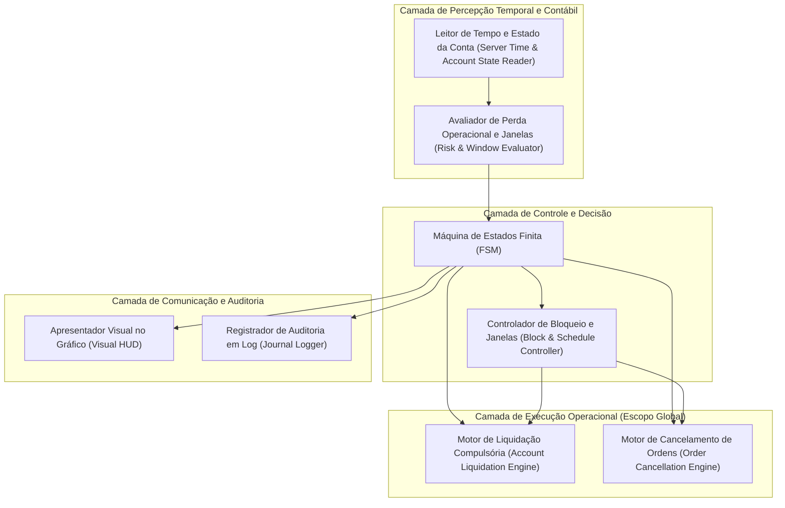
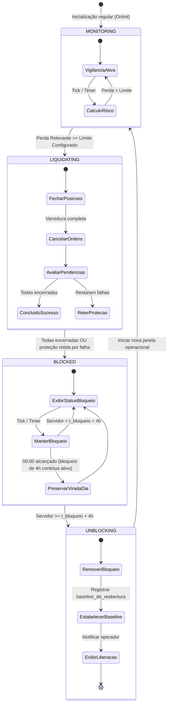

# 06 — Arquitetura Conceitual do EddyTrader

Este documento define a arquitetura conceitual e os blocos de responsabilidade do **EddyTrader**, atualizados com as deliberações de produto da **W02**. Este documento é puramente conceitual e normativo: **não define nem antecipa implementações de código MQL5 executável**.

---

## 1. Princípios Arquiteturais

A arquitetura conceitual do EddyTrader orienta-se por quatro diretrizes:

1. **Responsabilidade Única e Mínima:** Cada módulo conceitual possui uma atribuição estrita e delimitada.
2. **Determinismo e Isolamento:** Todas as transições operacionais ocorrem através de uma Máquina de Estados Finita (FSM) explícita.
3. **Tempo Soberano do Servidor:** Todos os cálculos e janelas temporais operam com base exclusiva no relógio do servidor de negociação da corretora.
4. **Reconstrução Determinística sobre Persistência:** O sistema prioriza a inferência e reconstrução do estado operacional a partir do histórico nativo da conta, evitando arquivos duplicados e estados inconsistentes.

---

## 2. Decomposição Conceitual de Responsabilidades

O sistema estrutura-se conceitualmente em sete módulos funcionais:

### 2.1. Leitor de Tempo e Estado da Conta (*Server Time & Account Reader*)
* **Responsabilidade:** Consultar o relógio do servidor de negociação, varrer o histórico diário (`00:00:00` às `23:59:59` do servidor), filtrar negócios de trading (ignorando depósitos/saques) e ler o flutuante líquido atual.

### 2.2. Avaliador de Perda Operacional e Janelas (*Risk & Window Evaluator*)
* **Responsabilidade:** Calcular o $\text{RESULTADO\_RELEVANTE}$ somando realizado líquido (com comissões e swaps) e flutuante atual, e medir a distância até o limite considerando a janela operacional ativa (incluindo eventual `baseline_de_reabertura`).

### 2.3. Máquina de Estados Finita (*FSM - Finite State Machine*)
* **Responsabilidade:** Controlar o ciclo de vida da proteção, governando as transições entre vigilância, contenção, bloqueio programado e liberação.

### 2.4. Motor de Liquidação Compulsória (*Account Liquidation Engine*)
* **Responsabilidade:** Emitir ordens de fechamento a mercado para 100% das posições abertas na conta (todos os símbolos e robôs), isolando falhas individuais sem interromper o processamento das demais.

### 2.5. Motor de Cancelamento de Ordens (*Order Cancellation Engine*)
* **Responsabilidade:** Emitir requisições de remoção para 100% das ordens pendentes existentes na conta.

### 2.6. Controlador de Bloqueio e Janelas (*Block & Schedule Controller*)
* **Responsabilidade:** Gerenciar a janela temporal de bloqueio de 4 horas a partir do acionamento ($t_{\text{unlock}} = t_{\text{bloqueio}} + 4\text{h}$), retendo o bloqueio após a meia-noite caso a janela atravesse a virada de dia e administrando o gatilho de reabertura de nova janela.

### 2.7. Apresentador Visual e Logger (*Visual HUD & Journal Logger*)
* **Responsabilidade:** Exibir no gráfico informações claras de status (relógio do servidor, limite, perdas, instante do bloqueio e previsão de liberação após 4h) e auditar eventos com carimbo de tempo do servidor no Diário do MT5.

---

## 3. Máquina de Estados Conceitual

O comportamento operacional do EddyTrader é governado por cinco estados formais:

### 3.1. Transições Críticas Detalhadas

1. **`MONITORING` $\to$ `LIQUIDATING`:** Disparada imediatamente quando o resultado financeiro atinge ou supera o limite negativo da janela.
2. **`LIQUIDATING` $\to$ `BLOCKED`:** Se todas as ordens e posições forem tratadas, entra em bloqueio. Se houver falhas de fechamento em ativos específicos, o sistema **não retorna a monitoramento normal**; transita para bloqueio/contenção retida até que todas as pendências sejam resolvidas.
3. **`BLOCKED` $\to$ `UNBLOCKING`:** Ocorre estritamente quando o relógio do servidor alcança o término das 4 horas contínuas ($T \ge T_{\text{unlock}}$, onde $T_{\text{unlock}} = T_0 + 4\text{h}$). A passagem pelas `00:00:00` não desarma o bloqueio ativo, mantendo a proteção integral até o término das 4 horas.
4. **`UNBLOCKING` $\to$ `MONITORING`:** Encerra o evento de bloqueio, calcula a `baseline_de_reabertura` para evitar falso rebloqueio imediato no mesmo tick e reabre o monitoramento para novas perdas na nova janela.

---

## 4. Reconstrução Determinística vs. Persistência em Disco

A decisão arquitetural de produto para o MVP ([D12](file:///C:/Projetos/eddytrader/docs/adr/0001-regras-temporais-e-janelas-de-protecao.md)) estabelece:

* **Prioridade Absoluta:** O EA deve reconstruir seu estado a partir dos registros contábeis nativos da conta e do histórico do terminal MT5.
* **Racional (KISS / YAGNI):** Evitar arquivos proprietários duplicados no disco reduz pontos de falha, corrupção de dados e complexidade operacional.
* **Reserva Técnica:** A W03/W04 delimitará se informações que não possam ser estritamente inferidas do histórico bruto (como a baseline de uma reabertura intradiária recente após restart do terminal) demandarão um registro leve em disco ou se há modelagem algorítmica puramente inferida.

---

## 5. Escopo da Conta e Restrição de Instância Única

* **Escopo Global da Conta (D13):** O EddyTrader não atua isolado no ativo do gráfico; sua governança se estende a todas as posições e ordens da conta de negociação.
* **Instância Única por Conta (D14):** O sistema opera sob o pressuposto de uma única instância por conta. Mecanismos de detecção ou restrição de instâncias concorrentes serão especificados em W04/W05.

---

## 6. A Questão do Bloqueio no MT5 (Encaminhamento para Spike Técnico)

Conforme mantido no catálogo de questões abertas ([DQ-001](file:///C:/Projetos/eddytrader/docs/08-RISCOS-E-QUESTOES-ABERTAS.md#dq-001--mecanismo-de-bloqueio-operacional-no-mt5)):
* O requisito de produto determina que novas operações não permaneçam ativas durante o bloqueio.
* Em MQL5 nativo puro, ordens manuais disparadas diretamente no terminal são tratadas por **neutralização reativa imediata**.
* A comprovação da latência, dos eventos de negociação (`OnTradeTransaction`) e do comportamento prático será executada no Spike Técnico laboratorial da **W05**.

---

## 7. Rastreabilidade Documental

* Requisitos Associados: [03 — Requisitos](file:///C:/Projetos/eddytrader/docs/03-REQUISITOS.md)
* Casos de Uso: [04 — Casos de Uso](file:///C:/Projetos/eddytrader/docs/04-CASOS-DE-USO.md)
* Regras Normativas: [05 — Regras de Negócio](file:///C:/Projetos/eddytrader/docs/05-REGRAS-DE-NEGOCIO.md)
* Decisões Arquiteturais: [ADR 0001](file:///C:/Projetos/eddytrader/docs/adr/0001-regras-temporais-e-janelas-de-protecao.md) e [ADR 0002](file:///C:/Projetos/eddytrader/docs/adr/0002-composicao-da-perda-operacional.md)
* Planejamento Incremental: [09 — Roadmap](file:///C:/Projetos/eddytrader/docs/09-ROADMAP.md)
