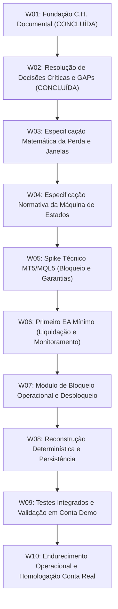

# 09 — Roadmap Incremental de Desenvolvimento

Este documento estabelece o planejamento ordenado das etapas de trabalho (*Work Packages* — W) para a construção do **EddyTrader**, aplicando o **Método C.H.** (Clareza antes de código, escopo mínimo, evidência antes de expansão, W incrementais).

---

## 1. Visão Geral das Etapas

---

## 2. Detalhamento dos Work Packages (W)

---

### W01 — Fundação Documental e Normativa
* **Status:** **CONCLUÍDA**
* **Objetivo:** Estabelecer a base documental, os limites contratuais, a matriz de requisitos e o mapeamento de riscos a partir dos requisitos aprovados.
* **Entregáveis:** Documentos `00` a `09` em `docs/`, `README.md` e `AGENTS.md`.
* **Critério de Conclusão:** Repositório documentado, consistente, rastreável e sem código executável.

---

### W02 — Resolução de Decisões Críticas e GAPs
* **Status:** **CONCLUÍDA**
* **Objetivo:** Resolver e formalizar contratualmente as decisões de produto e regras temporais e financeiras críticas.
* **Entregáveis:** 
  * [ADR 0001 — Regras Temporais e Janelas de Proteção](file:///C:/Projetos/eddytrader/docs/adr/0001-regras-temporais-e-janelas-de-protecao.md)
  * [ADR 0002 — Composição da Perda Operacional](file:///C:/Projetos/eddytrader/docs/adr/0002-composicao-da-perda-operacional.md)
  * Atualização dos documentos normativos (`03`, `04`, `05`, `06`, `07`, `08`, `09`, `README`).
* **Critério de Conclusão:** GAPs críticos (GAP-001 a GAP-004) resolvidos, cenários A–F validados documentalmente e zero código executável criado.

---

### W03 — Especificação Matemática da Perda e Janelas de Proteção
* **Status:** **PRÓXIMA ETAPA RECOMENDADA**
* **Objetivo:** Formalizar a especificação matemática rigorosa, equações algébricas e invariantes numéricos de:
  1. Resultado realizado do dia e cálculo líquido de comissões e swaps;
  2. Resultado flutuante atual e posições herdadas da virada do dia;
  3. Formulação matemática exata da `baseline_de_reabertura` para novas janelas operacionais intradiárias;
  4. Condição exata de acionamento do gatilho de proteção;
  5. Invariantes financeiros de exclusão de transferências de capital (depósitos/saques).
* **Entregáveis:** Documento normativo de Especificação Matemática e Invariantes Contábeis do EddyTrader.
* **Fora de Escopo:** Implementação de código MQL5 executável ou compilação.
* **Critério de Conclusão:** Todas as fórmulas e comportamentos numéricos especificados matematicamente e prontos para codificação.

---

### W04 — Especificação Normativa da Máquina de Estados
* **Status:** Planejada
* **Objetivo:** Desenhar o modelo formal determinístico da FSM (estados, eventos, transições, estruturas de dados MQL5 e política de reconstrução determinística de estado após restart do terminal).
* **Entregáveis:** Documento de Especificação Técnica da Máquina de Estados e Estrutura de Módulos MQL5.
* **Fora de Escopo:** Implementação de código MQL5 executável.
* **Critério de Conclusão:** FSM formalmente especificada com todas as transições mapeadas.

---

### W05 — Spike Técnico MT5/MQL5 (Garantias e Bloqueio)
* **Status:** Planejada
* **Objetivo:** Conduzir testes laboratoriais em ambiente MetaTrader 5 para validar na prática:
  1. Eficácia e latência da neutralização reativa imediata via `OnTradeTransaction()` vs. ordens manuais do terminal ([DQ-001](file:///C:/Projetos/eddytrader/docs/08-RISCOS-E-QUESTOES-ABERTAS.md#dq-001--mecanismo-tecnico-de-bloqueio-operacional-no-mt5));
  2. Comportamento de liquidação a mercado sob Hedging e Netting ([DQ-002](file:///C:/Projetos/eddytrader/docs/08-RISCOS-E-QUESTOES-ABERTAS.md#dq-002--tratamento-de-contas-netting-vs-hedging));
  3. Tolerância a slippage e deviation ([DQ-003](file:///C:/Projetos/eddytrader/docs/08-RISCOS-E-QUESTOES-ABERTAS.md#dq-003--politica-de-slippage-e-deviation-em-fechamento-de-emergencia));
  4. Resposta a ativos com pregão fechado ([DQ-004](file:///C:/Projetos/eddytrader/docs/08-RISCOS-E-QUESTOES-ABERTAS.md#dq-004--tratamento-de-ativos-com-mercado-fechado)).
* **Entregáveis:** Relatório técnico de evidências empíricas no MT5.
* **Critério de Conclusão:** Comprovação das garantias técnicas que o MQL5 nativo oferece para o bloqueio e liquidação.

---

### W06 — Primeiro EA Mínimo (Liquidação e Monitoramento)
* **Status:** Planejada
* **Objetivo:** Implementar o núcleo do primeiro EA MQL5 contendo os módulos de cálculo de perda e liquidação/cancelamento de emergência com isolamento de falhas.
* **Entregáveis:** Código-fonte MQL5 compilável sem erros no MetaEditor.
* **Critério de Conclusão:** EA calcula a perda real e executa fechamento de posições de teste em Conta Demo.

---

### W07 — Módulo de Bloqueio Operacional e Desbloqueio
* **Status:** Planejada
* **Objetivo:** Integrar as regras de bloqueio temporal sob o relógio do servidor, manutenção de bloqueio na virada de dia e abertura de nova janela com baseline.
* **Entregáveis:** EA integrado com FSM completa e comentários visuais no gráfico.
* **Critério de Conclusão:** Ciclo de bloqueio e reabertura temporal validado em Conta Demo.

---

### W08 — Reconstrução Determinística e Persistência
* **Status:** Planejada
* **Objetivo:** Implementar a restauração segura de estado no `OnInit()` a partir do histórico nativo de transações e posições da conta.
* **Entregáveis:** Módulo de recuperação pós-restart validado.
* **Critério de Conclusão:** Reinício intradiário do MT5 preserva estado bloqueado até o horário agendado.

---

### W09 — Testes Integrados e Validação em Conta Demo
* **Status:** Planejada
* **Objetivo:** Executar a suíte de testes do MVP ([TC-MVP-01 a TC-MVP-08](file:///C:/Projetos/eddytrader/docs/07-MVP.md#5-criterios-objetivos-de-aceite-do-mvp)) em ambiente real de simulação.
* **Entregáveis:** Relatório de evidências de homologação em Conta Demo com prints e logs.
* **Critério de Conclusão:** 100% dos testes aprovados em Conta Demo.

---

### W10 — Endurecimento Operacional e Homologação Conta Real
* **Status:** Planejada
* **Objetivo:** Refinamentos finais de resiliência, latência, reconexão de rede e autorização assistida para Conta Real.
* **Entregáveis:** Versão homologada do EddyTrader para produção.
* **Critério de Conclusão:** Aprovação formal do operador para uso assistido em Conta Real.

---

## 3. Rastreabilidade Documental

* Manifesto: [00 — Manifesto](file:///C:/Projetos/eddytrader/docs/00-MANIFESTO.md)
* Escopo e Proibições: [02 — Escopo e Limites](file:///C:/Projetos/eddytrader/docs/02-ESCOPO-E-LIMITES.md)
* Regras Normativas: [05 — Regras de Negócio](file:///C:/Projetos/eddytrader/docs/05-REGRAS-DE-NEGOCIO.md)
* Critérios do MVP: [07 — MVP](file:///C:/Projetos/eddytrader/docs/07-MVP.md)
* Decisões Arquiteturais: [ADR 0001](file:///C:/Projetos/eddytrader/docs/adr/0001-regras-temporais-e-janelas-de-protecao.md) e [ADR 0002](file:///C:/Projetos/eddytrader/docs/adr/0002-composicao-da-perda-operacional.md)
