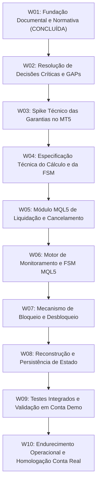

# 09 — Roadmap Incremental de Desenvolvimento

Este documento estabelece o planejamento ordenado das etapas de trabalho (*Work Packages* — W) para a construção do **EddyTrader**, aplicando o **Método C.H.** (Clareza antes de código, escopo mínimo, evidência antes de expansão, W incrementais).

---

## 1. Visão Geral das Etapas

---

## 2. Detalhamento dos Work Packages (W)

---

### W01 — Fundação Documental e Normativa
* **Status:** **CONCLUÍDA**
* **Objetivo:** Estabelecer a base documental, os limites contratuais, a matriz de requisitos e o mapeamento de riscos a partir dos requisitos aprovados.
* **Entregáveis:** Documentos `00` a `09` em `docs/`, `README.md` e `AGENTS.md`.
* **Fora de Escopo:** Qualquer implementação de código MQL5 (`.mq5`, `.mqh`, `.ex5`), protótipos funcionais ou alterações de escopo.
* **Critério de Conclusão:** Repositório documentado, consistente, rastreável e sem código executável.

---

### W02 — Resolução de Decisões Críticas e GAPs
* **Status:** **PRÓXIMA ETAPA RECOMENDADA**
* **Objetivo:** Submeter ao usuário/proprietário do produto as decisões registradas em [08 — Riscos e Questões Abertas](file:///C:/Projetos/eddytrader/docs/08-RISCOS-E-QUESTOES-ABERTAS.md) para obter deliberação formal sobre:
  1. Fuso horário de referência e marco inicial do dia ([GAP-001](file:///C:/Projetos/eddytrader/docs/08-RISCOS-E-QUESTOES-ABERTAS.md#gap-001--definicao-do-fuso-horario-e-marco-inicial-do-dia)).
  2. Tratamento exato de comissões, swaps, depósitos e saques ([GAP-002](file:///C:/Projetos/eddytrader/docs/08-RISCOS-E-QUESTOES-ABERTAS.md#gap-002--composicao-financeira-do-resultado-relevante)).
  3. Comportamento temporal do desbloqueio em cruzamento de horários ([GAP-003](file:///C:/Projetos/eddytrader/docs/08-RISCOS-E-QUESTOES-ABERTAS.md#gap-003--consistencia-temporal-do-horario-de-desbloqueio)).
  4. Decisão sobre modelo de persistência vs. reconstrução dinâmica ([GAP-005](file:///C:/Projetos/eddytrader/docs/08-RISCOS-E-QUESTOES-ABERTAS.md#gap-005--persistencia-e-reconstrucao-de-estado-apos-reinicializacao)).
* **Entregáveis:** Documento `docs/08-RISCOS-E-QUESTOES-ABERTAS.md` e `docs/05-REGRAS-DE-NEGOCIO.md` atualizados com as respostas e aprovações formais do usuário.
* **Fora de Escopo:** Codificação de EA ou implementação técnica.
* **Critério de Conclusão:** Todos os GAPs críticos respondidos formalmente pelo usuário.

---

### W03 — Spike Técnico das Garantias no MT5
* **Objetivo:** Conduzir teste laboratorial isolado em ambiente MT5 para comprovar as capacidades e limitações reais da plataforma para:
  1. Eficácia e tempo de resposta do bloqueio reativo imediato via `OnTradeTransaction()` vs. ordens manuais ([DQ-001](file:///C:/Projetos/eddytrader/docs/08-RISCOS-E-QUESTOES-ABERTAS.md#dq-001--mecanismo-de-bloqueio-operacional-no-mt5)).
  2. Comportamento de liquidação a mercado sob Hedging e Netting ([DQ-002](file:///C:/Projetos/eddytrader/docs/08-RISCOS-E-QUESTOES-ABERTAS.md#dq-002--tratamento-de-contas-netting-vs-hedging)).
  3. Avaliação de retcodes com mercado fechado ([DQ-004](file:///C:/Projetos/eddytrader/docs/08-RISCOS-E-QUESTOES-ABERTAS.md#dq-004--tratamento-de-mercado-fechado--ativos-iiquidos)).
* **Entregáveis:** Relatório técnico do Spike documentando evidências reais colhidas no MT5.
* **Fora de Escopo:** Construção do produto final ou EA definitivo.
* **Critério de Conclusão:** Viabilidade técnica comprovada com dados reais de comportamento do terminal.

---

### W04 — Especificação Técnica do Cálculo e da FSM
* **Objetivo:** Elaborar o desenho técnico detalhado com as fórmulas matemáticas homologadas em W02 e a especificação das assinaturas de funções e estruturas de dados em MQL5.
* **Entregáveis:** Documento de Especificação Técnica de Implementação (arquitetura física dos módulos MQL5).
* **Fora de Escopo:** Escrita de código executável final.
* **Critério de Conclusão:** Especificação validada e alinhada com as decisões de W02 e evidências de W03.

---

### W05 — Módulo MQL5 de Liquidação e Cancelamento
* **Objetivo:** Implementar em MQL5 a biblioteca/módulo responsável exclusivamente por iterar posições e ordens pendentes e emitir comandos de fechamento e cancelamento com isolamento de falhas.
* **Entregáveis:** Módulo MQL5 isolado (`LiquidationEngine.mqh`) com tratamento de retcodes e logging.
* **Fora de Escopo:** Interface gráfica, cálculos de dia ou lógica de bloqueio temporal.
* **Critério de Conclusão:** Módulo compila sem warnings no MetaEditor e fecha posições de teste em conta Demo.

---

### W06 — Motor de Monitoramento e FSM MQL5
* **Objetivo:** Implementar as rotinas de leitura de histórico, cálculo contínuo de perda diária e a máquina de estados nominal (`MONITORING` -> `LIQUIDATING`).
* **Entregáveis:** EA mínimo capaz de calcular a perda e disparar o módulo de liquidação ao atingir o limite.
* **Fora de Escopo:** Rotinas complexas de bloqueio de ordens manuais e interface gráfica rica.
* **Critério de Conclusão:** EA identifica violação de saldo/flutuante em conta Demo e executa o disparo da liquidação com sucesso.

---

### W07 — Mecanismo de Bloqueio e Desbloqueio
* **Objetivo:** Implementar a lógica de manutenção do estado `BLOCKED` (neutralização de novas operações) e o desarme da proteção no horário configurado (`UNLOCKED` -> `MONITORING`).
* **Entregáveis:** EA integrado com ciclo completo de bloqueio, liberação horária e comentários visuais no gráfico.
* **Fora de Escopo:** Persistência em disco complexa ou dashboards visuais avançados.
* **Critério de Conclusão:** Ciclo completo de bloqueio e desbloqueio temporal validado em conta Demo.

---

### W08 — Reconstrução e Persistência de Estado
* **Objetivo:** Implementar o modelo de resiliência a reinicializações acordado em W02 (reconstrução contábil dinâmica ou persistência local em `MQL5/Files`).
* **Entregáveis:** Módulo de persistência/reconstrução integrado ao `OnInit()`.
* **Fora de Escopo:** Bancos de dados externos ou sincronização na nuvem.
* **Critério de Conclusão:** EA reiniciado no meio de um período de bloqueio reconhece o estado anterior e permanece bloqueado até o horário devido.

---

### W09 — Testes Integrados e Validação em Conta Demo
* **Objetivo:** Executar a suíte completa de casos de teste do MVP ([TC-MVP-01 a TC-MVP-06](file:///C:/Projetos/eddytrader/docs/07-MVP.md#5-criterios-objetivos-de-aceite-do-mvp)) em ambiente real de simulação.
* **Entregáveis:** Relatório de evidências de homologação em Conta Demo com prints e logs de execução.
* **Fora de Escopo:** Operação com dinheiro real em Conta Real.
* **Critério de Conclusão:** 100% dos critérios de aceite do MVP atendidos com evidências comprovadas.

---

### W10 — Endurecimento Operacional e Homologação Conta Real
* **Objetivo:** Refinar parâmetros de desvio (*deviation*), validações de integridade, logs de auditoria e proteções contra desconexão de rede para disponibilização para Conta Real.
* **Entregáveis:** Versão final compilada do EA EddyTrader pronta para uso pelo operador em Conta Real.
* **Fora de Escopo:** Novas funcionalidades não aprovadas.
* **Critério de Conclusão:** Aprovação formal do usuário final para operação assistida em Conta Real.

---

## 3. Rastreabilidade Documental

* Manifesto Fundacional: [00 — Manifesto](file:///C:/Projetos/eddytrader/docs/00-MANIFESTO.md)
* Escopo e Proibições: [02 — Escopo e Limites](file:///C:/Projetos/eddytrader/docs/02-ESCOPO-E-LIMITES.md)
* Critérios de Aceite do MVP: [07 — MVP](file:///C:/Projetos/eddytrader/docs/07-MVP.md)
* Incertezas a Resolver na W02: [08 — Riscos e Questões Abertas](file:///C:/Projetos/eddytrader/docs/08-RISCOS-E-QUESTOES-ABERTAS.md)
