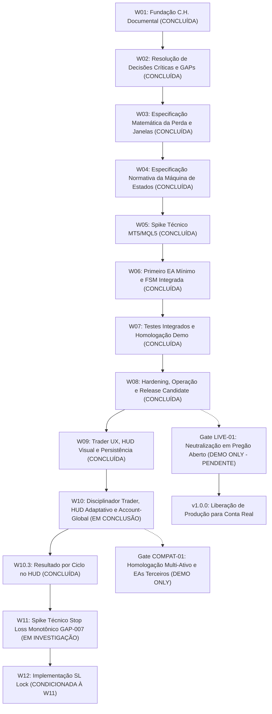

# 09 — Roadmap Incremental de Desenvolvimento

Este documento estabelece o planejamento ordenado das etapas de trabalho (*Work Packages* — W) para a construção do **EddyTrader**, aplicando o **Método C.H.** (Clareza antes de código, escopo mínimo, evidência antes de expansão, W incrementais).

---

## 1. Visão Geral das Etapas

---

## 2. Detalhamento dos Work Packages (W)

---

### W01 — Fundação Documental e Normativa
* **Status:** **CONCLUÍDA**
* **Objetivo:** Estabelecer a base documental, os limites contratuais, a matriz de requisitos e o mapeamento de riscos a partir dos requisitos aprovados.
* **Entregáveis:** Documentos `00` a `09` em `docs/`, `README.md` e `AGENTS.md`.
* **Critério de Conclusão:** Repositório documentado, consistente, rastreável e sem código executável.

---

### W02 — Resolução de Decisões Críticas e GAPs
* **Status:** **CONCLUÍDA**
* **Objetivo:** Resolver e formalizar contratualmente as decisões de produto e regras temporais e financeiras críticas.
* **Entregáveis:** 
  * [ADR 0001 — Regras Temporais e Janelas de Proteção](file:///C:/Projetos/eddytrader/docs/adr/0001-regras-temporais-e-janelas-de-protecao.md)
  * [ADR 0002 — Composição da Perda Operacional](file:///C:/Projetos/eddytrader/docs/adr/0002-composicao-da-perda-operacional.md)
  * Atualização dos documentos normativos (`03`, `04`, `05`, `06`, `07`, `08`, `09`, `README`).
* **Critério de Conclusão:** GAPs críticos (GAP-001 a GAP-004) resolvidos, cenários A–F validados documentalmente e zero código executável criado.

---

### W03 — Especificação Matemática da Perda e Janelas de Proteção
* **Status:** **CONCLUÍDA**
* **Objetivo:** Formalizar a especificação matemática rigorosa, equações algébricas e invariantes numéricos de:
  1. Resultado realizado do dia e cálculo líquido de comissões e swaps;
  2. Resultado flutuante atual e posições herdadas da virada do dia;
  3. Formulação matemática exata da `baseline_de_reabertura` para novas janelas operacionais intradiárias;
  4. Condição exata de acionamento do gatilho de proteção;
  5. Invariantes financeiros de exclusão de transferências de capital (depósitos/saques).
* **Entregáveis:**
  * [10 — Especificação Matemática da Perda e Janelas](file:///C:/Projetos/eddytrader/docs/10-ESPECIFICACAO-MATEMATICA.md)
  * [ADR 0003 — Modelo Matemático de Janelas Operacionais e Baseline de Reabertura](file:///C:/Projetos/eddytrader/docs/adr/0003-modelo-matematico-de-janelas-e-baseline.md)
* **Critério de Conclusão:** Resolução do GAP-006, reavaliação do GAP-005, definição dos invariantes INV-001 a INV-010, validação documental dos cenários MATH-01 a MATH-10 e zero código executável criado.

---

### W04 — Especificação Normativa da Máquina de Estados
* **Status:** **CONCLUÍDA**
* **Objetivo:** Desenhar o modelo formal determinístico da FSM (estados, eventos, transições conceituais, guards, transições proibidas, protocolo de restart determinístico e dados conceituais de recuperação).
* **Entregáveis:**
  * [11 — Especificação Normativa da Máquina de Estados](file:///C:/Projetos/eddytrader/docs/11-MAQUINA-DE-ESTADOS.md)
  * [ADR 0004 — Máquina de Estados Finita Normativa e Protocolo de Recuperação](file:///C:/Projetos/eddytrader/docs/adr/0004-maquina-de-estados-e-recuperacao.md)
* **Critério de Conclusão:** FSM formalizada com 6 estados conceituais, guards estritos, transições proibidas, invariantes FSM-INV-001 a FSM-INV-014, protocolo de restart determinístico, suíte FSM-01 a FSM-19 validada documentalmente e zero código MQL5 criado.

---

### W05 — Spike Técnico MT5/MQL5 (Garantias e Bloqueio)
* **Status:** **CONCLUÍDA**
* **Objetivo:** Conduzir testes laboratoriais em ambiente MetaTrader 5 para validar na prática:
  1. Eficácia e latência da neutralização reativa imediata via `OnTradeTransaction()` vs. ordens manuais do terminal ([DQ-001](file:///C:/Projetos/eddytrader/docs/08-RISCOS-E-QUESTOES-ABERTAS.md#dq-001--mecanismo-tecnico-de-bloqueio-operacional-no-mt5));
  2. Comportamento de liquidação a mercado sob Hedging e Netting ([DQ-002](file:///C:/Projetos/eddytrader/docs/08-RISCOS-E-QUESTOES-ABERTAS.md#dq-002--tratamento-de-contas-netting-vs-hedging));
  3. Tolerância a slippage e deviation ([DQ-003](file:///C:/Projetos/eddytrader/docs/08-RISCOS-E-QUESTOES-ABERTAS.md#dq-003--politica-de-slippage-e-deviation-em-fechamento-de-emergencia));
  4. Resposta a ativos com pregão fechado ([DQ-004](file:///C:/Projetos/eddytrader/docs/08-RISCOS-E-QUESTOES-ABERTAS.md#dq-004--tratamento-de-ativos-com-mercado-fechado));
  5. Validação empírica da recuperação dos dados mínimos de estado ($\mathbf{D}_{\text{min\_recovery}}$) a partir do histórico nativo do terminal vs. persistência em Global Variables ([GAP-005](file:///C:/Projetos/eddytrader/docs/08-RISCOS-E-QUESTOES-ABERTAS.md#gap-005--persistência-e-reconstrução-de-estado-após-reinicialização)).
* **Entregáveis:** [12 — Spike Técnico MT5/MQL5](file:///C:/Projetos/eddytrader/docs/12-SPIKE-TECNICO-MT5.md) e [ADR 0005](file:///C:/Projetos/eddytrader/docs/adr/0005-garantias-tecnicas-mt5-e-estrategia-de-recuperacao.md).
* **Critério de Conclusão:** Comprovação das garantias técnicas que o MQL5 nativo oferece para o bloqueio, liquidação e recuperação.

---

### W06 — Primeiro EA Mínimo (Liquidação e Monitoramento)
* **Status:** **CONCLUÍDA**
* **Objetivo:** Implementar o código MQL5 do primeiro Expert Advisor funcional com foco exclusivo em:
  1. Parâmetro de entrada `InpMaxLoss` e validação estrita;
  2. Cálculo contínuo do resultado diário e flutuante;
  3. Detecção da condição de disparo;
  4. Varredura e emissão de ordens de liquidação a mercado para todas as posições da conta;
  5. Varredura e cancelamento de ordens pendentes;
  6. Guarda de instância única via CAS atômico (`OWNER` + `HEARTBEAT`);
  7. Registro estruturado de logs de auditoria no Diário.
* **Entregáveis:** Código-fonte MQL5 compilável (`src/EddyTrader.mq5`, `src/EddyFSM.mqh`, `src/EddyMath.mqh`, `src/EddyTrade.mqh`, `src/EddyStorage.mqh`), harness de testes (`tests/test_fsm_w06.mq5`) e documentação [13 — Implementação do MVP (W06)](file:///C:/Projetos/eddytrader/docs/13-IMPLEMENTACAO-MVP-W06.md).
* **Critério de Conclusão:** EA compila com 0 erros/avisos e 20/20 testes unitários/lógicos aprovados.

---

### W07 — Testes Integrados e Homologação Operacional em Conta Demo
* **Status:** **CONCLUÍDA (HOMOLOGADO COM RESSALVAS)**
* **Objetivo:** Validar empiricamente em ambiente de conta Demo conectada ao vivo todas as garantias técnicas, concorrência, retcodes remotos, recuperação e fluxo de reabertura.
* **Entregáveis:** Documento [14 — Homologação Operacional em Conta Demo (W07)](file:///C:/Projetos/eddytrader/docs/14-HOMOLOGACAO-W07.md), bateria DEMO-01 a DEMO-15 (36/36 asserções aprovadas) e regressão formal unificada `test_fsm_w06.mq5` (26/26 asserções aprovadas).
* **Critério de Conclusão:** Aprovação com ressalva externa: validação empírica da neutralização reativa ponta a ponta em pregão aberto formalizada como teste de aceitação `LIVE-01`.

---

### W08 — Hardening, Operação e Release Candidate do EddyTrader
* **Status:** **CONCLUÍDA (RC1 APROVADO)**
* **Objetivo:** Transformar o núcleo operacional existente em um Release Candidate formal (`1.0.0-rc1`), reprodutível, auditado estaticamente, defensivo e completamente documentado.
* **Entregáveis:**
  * Build oficial automatizado via PowerShell: `scripts/build.ps1` (compilação limpa de 6 artefatos, 0 erros, 0 warnings).
  * Hardening de inputs, timer com fallback gracioso, flush síncrono e verificação booleana em persistência, rate-limiting de logs (5s) em retry de liquidação, tickets e símbolos estruturados.
  * [15 — Guia Operacional do EddyTrader](file:///C:/Projetos/eddytrader/docs/15-GUIA-OPERACIONAL.md).
  * [16 — Checklist de Release Candidate](file:///C:/Projetos/eddytrader/docs/16-RELEASE-CHECKLIST.md).
  * [17 — Release Notes 1.0.0-rc1](file:///C:/Projetos/eddytrader/docs/17-RELEASE-NOTES-1.0.0-rc1.md).
* **Critério de Conclusão:** Build limpo, suíte de regressão 28/28 aprovada, auditoria estática aprovada, checklist formal preenchido.

---

### W09 — Trader UX, HUD Visual e Experiência Operacional
* **Status:** **CONCLUÍDA (W09.1, W09.2, W09.3 INTEGRADAS)**
* **Objetivo:** Transformar a experiência visual e cognitiva do operador com:
  1. Painel HUD visual no gráfico com modos Compacto e Detalhado;
  2. Toggle dinâmico por clique de mouse (`[ + DETALHES ]` / `[ — RESUMO ]`);
  3. Alinhamento anti-sobreposição à esquerda com salvaguarda para o painel *One-Click Trading*;
  4. Persistência de preferências de visualização em Global Variables do Terminal MT5;
  5. Desacoplamento arquitetural entre falha visual e FSM do motor de risco (falha de HUD nunca causa fail-closed operacional);
  6. Release Candidate 2 (`1.0.0-rc2`).
* **Entregáveis:** HUD integrado em `src/EddyTrader.mq5`, bateria de regressão expandida para 57 testes em `tests/test_fsm_w06.mq5`, `docs/19- Trader-UX-HUD.md` e [20 — Release Notes 1.0.0-rc2](file:///C:/Projetos/eddytrader/docs/20-RELEASE-NOTES-1.0.0-rc2.md).
* **Critério de Conclusão:** 57/57 testes aprovados, build 0 erros / 0 avisos, integração na branch master.

---

### W10 — Fundação do Disciplinador Trader, HUD Adaptativo e Compatibilidade Account-Global
* **Status:** **W CORRENTE / EM CONCLUSÃO**
* **Objetivo:** Consolidar a evolução de produto decorrente do feedback de usuário real ("Cobaia"):
  1. Formalização da identidade pública normativa **"Disciplinador Trader"** mantendo legados internos técnicos intactos (`EddyTrader.mq5`, chaves `EDDY_*`, prefixo de objetos `EddyHUD_*`);
  2. Implementação do estado minimizado do HUD (`PANEL_EXPANDED` vs `PANEL_COLLAPSED`) com toggle dinâmico `[ — MINIMIZAR ]` / `[ + ]` no canto superior esquerdo e restauração de modo anterior (`COMPACT` ou `DETAILED`);
  3. Persistência do estado de colapso visual per-account (`EDDY_<LOGIN>_CONFIG_PANEL_COLLAPSED`), não-fatal e desacoplada de $\mathbf{D}_{\text{min\_recovery}}$;
  4. Consolidação da arquitetura *Account-Global* e convivência operacional com Chart Trade / outros EAs em gráficos separados (Requisito `RF-015`);
  5. Criação do probe laboratorial de convivência `tests/probe_external_ea_w10.mq5` e definição do procedimento de teste `COMPAT-01`;
  6. Catalogação formal do `GAP-007` para Stop Loss Lock sem codificação prematura na W10;
  7. Manutenção estrita do motor matemático, FSM e garantias de liquidação intocadas;
  8. Preparação do Release Candidate 3 (`1.0.0-rc3`).
* **Entregáveis:** `src/EddyTrader.mq5` atualizado, probe `tests/probe_external_ea_w10.mq5`, teste visual automatizado `tests/test_visual_w10.mq5`, regressão expandida para 75 testes (W10R-01 a W10R-18, incluindo W10.2), [21 — Release Notes 1.0.0-rc3](file:///C:/Projetos/eddytrader/docs/21-RELEASE-NOTES-1.0.0-rc3.md).
* **Critério de Conclusão:** 75/75 testes aprovados, 11/11 validações visuais automáticas aprovadas, compilação 100% limpa (0 erros, 0 avisos), documentação harmonizada.

---

### W10.3 — Resultado por Ciclo no HUD
* **Status:** **CONCLUÍDA**
* **Objetivo:** Reiniciar visualmente o resultado do HUD em `0,00` após `REOPENING`, usando $W_n(t)=D(t)-B_n$, sem apagar ou adulterar o resultado diário acumulado $D(t)$.
* **Escopo Entregue:**
  1. HUD Compacto e Minimizado passam a exibir o resultado do ciclo ativo $W_n$;
  2. HUD Detalhado distingue explicitamente Resultado do Ciclo ($W_n$), Resultado do Dia ($D$) e Baseline do Ciclo ($B_n$);
  3. diálogo de confirmação de limite mantém a mesma semântica do ciclo;
  4. FSM, bloqueio de 4 horas, persistência, ownership/heartbeat, neutralização Account-Global e configuração de limite permanecem inalterados;
  5. regressão expandida com `W10.3R-01` a `W10.3R-06` e validação visual expandida para 14 passos.
* **Critério de Conclusão:** 81/81 testes formais aprovados, 14/14 validações visuais aprovadas, build completo com 0 erros / 0 avisos e diff revisado.

---

### W11 — Spike Técnico: Proteção Monotônica de Stop Loss (SL Lock)
* **Status:** **EM INVESTIGAÇÃO — EVIDÊNCIA PARCIAL**
* **Objetivo:** Investigar empiricamente em laboratório as 12 questões catalogadas no `GAP-007` a respeito da viabilidade de monitoramento e reversão monotônica de Stop Loss de posições manuais/automáticas.
* **Entregáveis Atuais:** [23 — Spike W11 SL Lock](file:///C:/Projetos/eddytrader/docs/23-SPIKE-W11-SL-LOCK.md), probe observacional Demo-only `research/w11/probe_sl_lock_w11.mq5` e teste puro `research/w11/test_sl_monotonic_w11.mq5` (7/7 PASS).
* **Situação:** Detecção e matemática monotônica possuem evidência inicial. O PO decidiu que falha na restauração do último SL protegido deve provocar fechamento imediato da posição. Restauração corretiva, rejeição/throttling, Hedging, persistência, concorrência e carga multiativo permanecem tecnicamente abertas; a política de posição sem SL inicial ainda depende de decisão do PO.
* **Critério de Conclusão:** Todas as 12 questões empíricas respondidas com evidências do MT5, sem implementação em produção. Critério ainda não atendido.

---

### W12 — Implementação de Stop Loss Lock e Proteções Avançadas
* **Status:** **FUTURA / CONDICIONADA À APROVAÇÃO DA W11**
* **Objetivo:** Caso o Spike W11 demonstre viabilidade técnica e ausência de riscos críticos de rejeição/throttling de corretora, implementar a proteção monotônica de Stop Loss na conta.
* **Entregáveis:** Módulo de proteção monotônica de SL, testes de regressão específicos e documentação normativa atualizada.
* **Critério de Conclusão:** Aprovação dos testes unitários e homologação em conta demo.

---

## 3. Gates Operacionais

### Gate LIVE-01 — Validação de Neutralização em Pregão Aberto
* **Status:** **PENDENTE (DEMO ONLY)**
* **Objetivo:** Validar empiricamente a latência e a efetividade da neutralização reativa ponta a ponta em ambiente de mercado aberto com book real e ordens manuais instantâneas.
* **Condição:** Exclusivamente em conta Demo durante horário regular de pregão. Pré-requisito para transição de `ADR 0005` para `Accepted` e liberação de v1.0.0 final.

### Gate COMPAT-01 — Convivência Multi-Ativo e EAs Terceiros
* **Status:** **PLANEJADO / LAB PRONTO (DEMO ONLY)**
* **Objetivo:** Validar empiricamente em conta Demo que o Disciplinador Trader atuando no Gráfico B fecha posições abertas por outros EAs ou Chart Trade manual no Gráfico A assim que a perda da conta atinge o limite diário configurado, sem interrupção de Magic Numbers.
* **Artefato de Suporte:** `tests/probe_external_ea_w10.mq5`.

---

## 4. Rastreabilidade Documental

* Manifesto: [00 — Manifesto](file:///C:/Projetos/eddytrader/docs/00-MANIFESTO.md)
* Visão Geral: [01 — Visão Geral](file:///C:/Projetos/eddytrader/docs/01-VISAO-GERAL.md)
* Escopo e Proibições: [02 — Escopo e Limites](file:///C:/Projetos/eddytrader/docs/02-ESCOPO-E-LIMITES.md)
* Requisitos do Sistema: [03 — Requisitos](file:///C:/Projetos/eddytrader/docs/03-REQUISITOS.md)
* Casos de Uso: [04 — Casos de Uso](file:///C:/Projetos/eddytrader/docs/04-CASOS-DE-USO.md)
* Regras Normativas: [05 — Regras de Negócio](file:///C:/Projetos/eddytrader/docs/05-REGRAS-DE-NEGOCIO.md)
* Arquitetura Conceitual: [06 — Arquitetura Conceitual](file:///C:/Projetos/eddytrader/docs/06-ARQUITETURA-CONCEITUAL.md)
* Critérios do MVP: [07 — MVP](file:///C:/Projetos/eddytrader/docs/07-MVP.md)
* Riscos e GAPs: [08 — Riscos e Questões Abertas](file:///C:/Projetos/eddytrader/docs/08-RISCOS-E-QUESTOES-ABERTAS.md)
* Especificação Matemática: [10 — Especificação Matemática](file:///C:/Projetos/eddytrader/docs/10-ESPECIFICACAO-MATEMATICA.md)
* Máquina de Estados Finita: [11 — Máquina de Estados](file:///C:/Projetos/eddytrader/docs/11-MAQUINA-DE-ESTADOS.md)
* Decisões Arquiteturais: [ADR 0001](file:///C:/Projetos/eddytrader/docs/adr/0001-regras-temporais-e-janelas-de-protecao.md), [ADR 0002](file:///C:/Projetos/eddytrader/docs/adr/0002-composicao-da-perda-operacional.md), [ADR 0003](file:///C:/Projetos/eddytrader/docs/adr/0003-modelo-matematico-de-janelas-e-baseline.md), [ADR 0004](file:///C:/Projetos/eddytrader/docs/adr/0004-maquina-de-estados-e-recuperacao.md) e [ADR 0005](file:///C:/Projetos/eddytrader/docs/adr/0005-garantias-tecnicas-mt5-e-estrategia-de-recuperacao.md)
* Guia Operacional e Releases: [15 — Guia Operacional](file:///C:/Projetos/eddytrader/docs/15-GUIA-OPERACIONAL.md), [16 — Checklist de Release](file:///C:/Projetos/eddytrader/docs/16-RELEASE-CHECKLIST.md), [17 — Release Notes 1.0.0-rc1](file:///C:/Projetos/eddytrader/docs/17-RELEASE-NOTES-1.0.0-rc1.md), [20 — Release Notes 1.0.0-rc2](file:///C:/Projetos/eddytrader/docs/20-RELEASE-NOTES-1.0.0-rc2.md) e [21 — Release Notes 1.0.0-rc3](file:///C:/Projetos/eddytrader/docs/21-RELEASE-NOTES-1.0.0-rc3.md)

