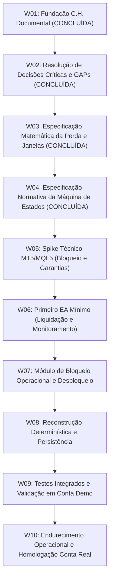

# 09 — Roadmap Incremental de Desenvolvimento

Este documento estabelece o planejamento ordenado das etapas de trabalho (*Work Packages* — W) para a construção do **EddyTrader**, aplicando o **Método C.H.** (Clareza antes de código, escopo mínimo, evidência antes de expansão, W incrementais).

---

## 1. Visão Geral das Etapas

---

## 2. Detalhamento dos Work Packages (W)

---

### W01 — Fundação Documental e Normativa
* **Status:** **CONCLUÍDA**
* **Objetivo:** Estabelecer a base documental, os limites contratuais, a matriz de requisitos e o mapeamento de riscos a partir dos requisitos aprovados.
* **Entregáveis:** Documentos `00` a `09` em `docs/`, `README.md` e `AGENTS.md`.
* **Critério de Conclusão:** Repositório documentado, consistente, rastreável e sem código executável.

---

### W02 — Resolução de Decisões Críticas e GAPs
* **Status:** **CONCLUÍDA**
* **Objetivo:** Resolver e formalizar contratualmente as decisões de produto e regras temporais e financeiras críticas.
* **Entregáveis:** 
  * [ADR 0001 — Regras Temporais e Janelas de Proteção](file:///C:/Projetos/eddytrader/docs/adr/0001-regras-temporais-e-janelas-de-protecao.md)
  * [ADR 0002 — Composição da Perda Operacional](file:///C:/Projetos/eddytrader/docs/adr/0002-composicao-da-perda-operacional.md)
  * Atualização dos documentos normativos (`03`, `04`, `05`, `06`, `07`, `08`, `09`, `README`).
* **Critério de Conclusão:** GAPs críticos (GAP-001 a GAP-004) resolvidos, cenários A–F validados documentalmente e zero código executável criado.

---

### W03 — Especificação Matemática da Perda e Janelas de Proteção
* **Status:** **CONCLUÍDA**
* **Objetivo:** Formalizar a especificação matemática rigorosa, equações algébricas e invariantes numéricos de:
  1. Resultado realizado do dia e cálculo líquido de comissões e swaps;
  2. Resultado flutuante atual e posições herdadas da virada do dia;
  3. Formulação matemática exata da `baseline_de_reabertura` para novas janelas operacionais intradiárias;
  4. Condição exata de acionamento do gatilho de proteção;
  5. Invariantes financeiros de exclusão de transferências de capital (depósitos/saques).
* **Entregáveis:**
  * [10 — Especificação Matemática da Perda e Janelas](file:///C:/Projetos/eddytrader/docs/10-ESPECIFICACAO-MATEMATICA.md)
  * [ADR 0003 — Modelo Matemático de Janelas Operacionais e Baseline de Reabertura](file:///C:/Projetos/eddytrader/docs/adr/0003-modelo-matematico-de-janelas-e-baseline.md)
* **Critério de Conclusão:** Resolução do GAP-006, reavaliação do GAP-005, definição dos invariantes INV-001 a INV-010, validação documental dos cenários MATH-01 a MATH-10 e zero código executável criado.

---

### W04 — Especificação Normativa da Máquina de Estados
* **Status:** **CONCLUÍDA**
* **Objetivo:** Desenhar o modelo formal determinístico da FSM (estados, eventos, transições conceituais, guards, transições proibidas, protocolo de restart determinístico e dados conceituais de recuperação).
* **Entregáveis:**
  * [11 — Especificação Normativa da Máquina de Estados](file:///C:/Projetos/eddytrader/docs/11-MAQUINA-DE-ESTADOS.md)
  * [ADR 0004 — Máquina de Estados Finita Normativa e Protocolo de Recuperação](file:///C:/Projetos/eddytrader/docs/adr/0004-maquina-de-estados-e-recuperacao.md)
* **Critério de Conclusão:** FSM formalizada com 6 estados conceituais, guards estritos, transições proibidas, invariantes FSM-INV-001 a FSM-INV-014, protocolo de restart determinístico, suíte FSM-01 a FSM-19 validada documentalmente e zero código MQL5 criado.

---

### W05 — Spike Técnico MT5/MQL5 (Garantias e Bloqueio)
* **Status:** **PRÓXIMA ETAPA RECOMENDADA**
* **Objetivo:** Conduzir testes laboratoriais em ambiente MetaTrader 5 para validar na prática:
  1. Eficácia e latência da neutralização reativa imediata via `OnTradeTransaction()` vs. ordens manuais do terminal ([DQ-001](file:///C:/Projetos/eddytrader/docs/08-RISCOS-E-QUESTOES-ABERTAS.md#dq-001--mecanismo-tecnico-de-bloqueio-operacional-no-mt5));
  2. Comportamento de liquidação a mercado sob Hedging e Netting ([DQ-002](file:///C:/Projetos/eddytrader/docs/08-RISCOS-E-QUESTOES-ABERTAS.md#dq-002--tratamento-de-contas-netting-vs-hedging));
  3. Tolerância a slippage e deviation ([DQ-003](file:///C:/Projetos/eddytrader/docs/08-RISCOS-E-QUESTOES-ABERTAS.md#dq-003--politica-de-slippage-e-deviation-em-fechamento-de-emergencia));
  4. Resposta a ativos com pregão fechado ([DQ-004](file:///C:/Projetos/eddytrader/docs/08-RISCOS-E-QUESTOES-ABERTAS.md#dq-004--tratamento-de-ativos-com-mercado-fechado));
  5. Validação empírica da recuperação dos dados mínimos de estado ($\mathbf{D}_{\text{min\_recovery}}$) a partir do histórico nativo do terminal vs. necessidade de persistência leve ([GAP-005](file:///C:/Projetos/eddytrader/docs/08-RISCOS-E-QUESTOES-ABERTAS.md#gap-005--persistência-e-reconstrução-de-estado-após-reinicialização)).
* **Entregáveis:** Relatório técnico de evidências empíricas no MT5.
* **Critério de Conclusão:** Comprovação das garantias técnicas que o MQL5 nativo oferece para o bloqueio, liquidação e recuperação.

---

### W06 — Primeiro EA Mínimo (Liquidação e Monitoramento)
* **Status:** Planejada
* **Objetivo:** Implementar o código MQL5 do primeiro Expert Advisor funcional com foco exclusivo em:
  1. Parâmetro de entrada `InpDailyLossLimit` e validação estrita;
  2. Cálculo contínuo do resultado diário e flutuante;
  3. Detecção da condição de disparo;
  4. Varredura e emissão de ordens de liquidação a mercado para todas as posições da conta;
  5. Varredura e cancelamento de ordens pendentes;
  6. Registro estruturado de logs de auditoria no Diário.
* **Entregáveis:** Código-fonte MQL5 compilável do EA e módulos auxiliares mínimos (`.mq5` e `.mqh`).
* **Critério de Conclusão:** EA compila com zero erros/avisos e liquida posições com sucesso no Strategy Tester / Demo.

---

### W07 — Módulo de Bloqueio Operacional e Desbloqueio
* **Status:** Planejada
* **Objetivo:** Implementar o controlador de tempo e o mecanismo de bloqueio de 4 horas a partir do acionamento, independência de virada de dia e nova janela via baseline de reabertura.
* **Entregáveis:** Módulo MQL5 de controle de bloqueio e liberação temporal.
* **Critério de Conclusão:** Cenários de bloqueio de 4 horas (inclusive atravessando 00:00:00) e liberação com baseline validados em Conta Demo.

---

### W08 — Reconstrução Determinística e Persistência
* **Status:** Planejada
* **Objetivo:** Implementar a lógica de restauração de estado do EA após reinicialização do terminal baseada nas conclusões de W04 e W05.
* **Entregáveis:** Módulo de recuperação de estado no `OnInit()`.
* **Critério de Conclusão:** EA reiniciado em Conta Demo durante bloqueio ativo restaura o bloqueio com tempo exato remanescente sem falhas.

---

### W09 — Testes Integrados e Validação em Conta Demo
* **Status:** Planejada
* **Objetivo:** Executar a bateria completa dos Casos de Teste do MVP ([TC-MVP-01 a TC-MVP-08](file:///C:/Projetos/eddytrader/docs/07-MVP.md#5-critérios-objetivos-de-aceite-do-mvp)) em ambiente de Conta Demo em tempo real.
* **Entregáveis:** Relatório formal de homologação do MVP com logs de execução.
* **Critério de Conclusão:** 100% de aprovação nos critérios de aceite do MVP.

---

### W10 — Endurecimento Operacional e Homologação para Conta Real
* **Status:** Planejada
* **Objetivo:** Tratamento defensivo de edge cases, revisão de documentação final e liberação formal do produto.
* **Entregáveis:** Release v1.0 do EddyTrader e guia operacional.
* **Critério de Conclusão:** Aprovação formal para execução em Conta Real.

---

## 3. Rastreabilidade Documental

* Manifesto: [00 — Manifesto](file:///C:/Projetos/eddytrader/docs/00-MANIFESTO.md)
* Escopo e Proibições: [02 — Escopo e Limites](file:///C:/Projetos/eddytrader/docs/02-ESCOPO-E-LIMITES.md)
* Regras Normativas: [05 — Regras de Negócio](file:///C:/Projetos/eddytrader/docs/05-REGRAS-DE-NEGOCIO.md)
* Critérios do MVP: [07 — MVP](file:///C:/Projetos/eddytrader/docs/07-MVP.md)
* Especificação Matemática: [10 — Especificação Matemática](file:///C:/Projetos/eddytrader/docs/10-ESPECIFICACAO-MATEMATICA.md)
* Máquina de Estados Finita: [11 — Máquina de Estados](file:///C:/Projetos/eddytrader/docs/11-MAQUINA-DE-ESTADOS.md)
* Decisões Arquiteturais: [ADR 0001](file:///C:/Projetos/eddytrader/docs/adr/0001-regras-temporais-e-janelas-de-protecao.md), [ADR 0002](file:///C:/Projetos/eddytrader/docs/adr/0002-composicao-da-perda-operacional.md), [ADR 0003](file:///C:/Projetos/eddytrader/docs/adr/0003-modelo-matematico-de-janelas-e-baseline.md) e [ADR 0004](file:///C:/Projetos/eddytrader/docs/adr/0004-maquina-de-estados-e-recuperacao.md)
