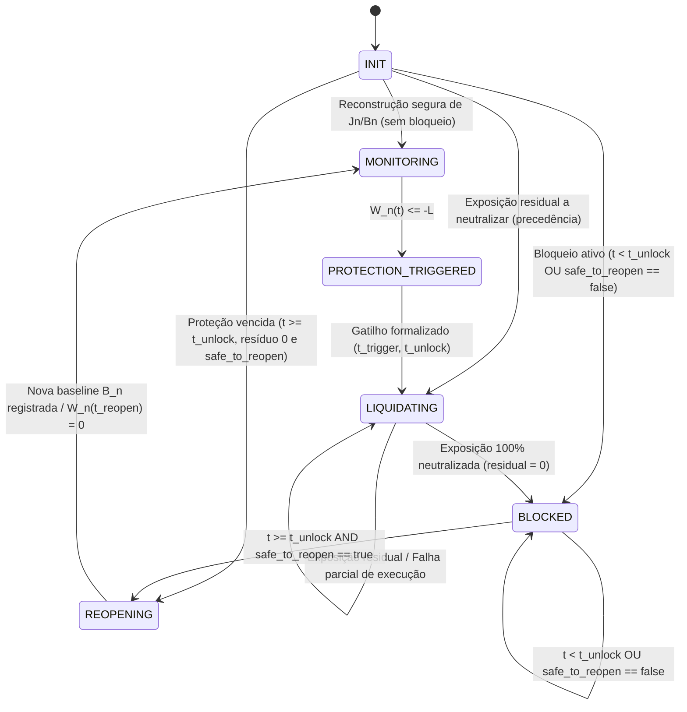
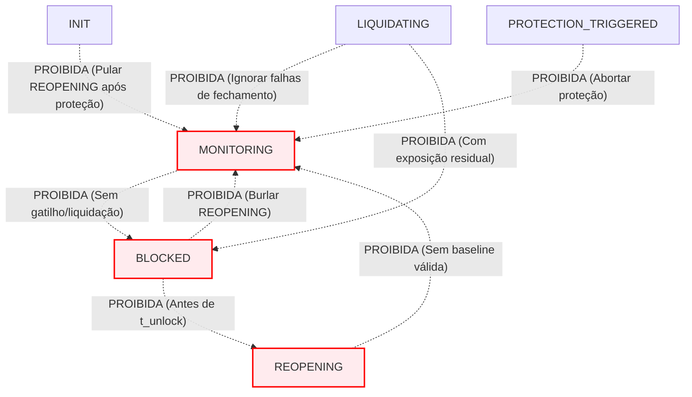
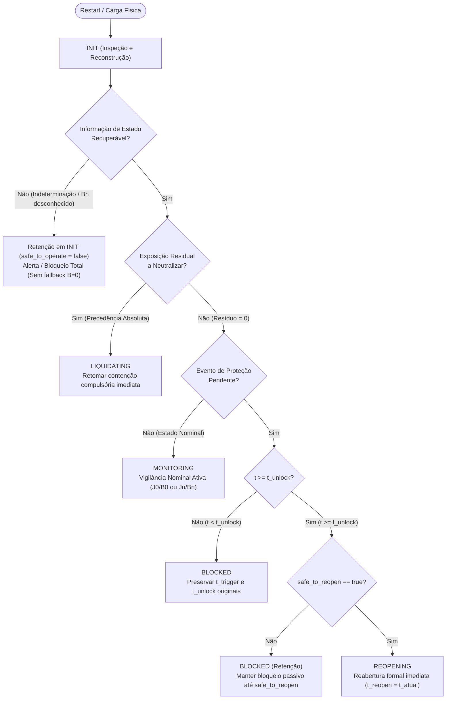

# 11 — Especificação Normativa da Máquina de Estados (FSM)

Este documento estabelece a especificação formal, determinística e exaustiva da **Máquina de Estados Finita (Finite State Machine - FSM)** do **EddyTrader**. 

O propósito deste documento é fornecer uma modelagem conceitual estrita e independente de plataforma, respondendo de forma inequívoca:
1. Em qual estado operacional o EddyTrader se encontra em qualquer instante $t$;
2. Quais eventos conceituais provocam transições entre estados;
3. Quais condições de guarda (*guards*) governam cada transição;
4. Quais transições são terminantemente proibidas para garantir a integridade do capital;
5. Quais dados conceituais mínimos formam o estado operacional do sistema e garantem sua reconstituição determinística após reinicializações do terminal.

---

## 1. Princípios de Modelagem e Invariantes Herdados

A presente especificação é puramente **conceitual e normativa**, não assumindo estruturas de código, bibliotecas ou chamadas a APIs específicas do MetaTrader 5 (reservadas para W05 e W06).

A FSM subordina-se incondicionalmente aos invariantes matemáticos e de produto formalizados na **W01**, **W02** e **W03**:

1. **Horário do Servidor:** A referência temporal $t$ é exclusivamente a do relógio oficial do servidor de negociação da corretora.
2. **Dia Operacional:** O ciclo contábil diário inicia-se às `00:00:00` e encerra-se às `23:59:59` do servidor.
3. **Métrica Financeira Diária Consolidada:**
   $$D(t) = R_{\text{day}}(t) + F(t)$$
   onde $R_{\text{day}}(t)$ é o resultado econômico líquido realizado de trading do dia e $F(t)$ é o flutuante líquido total de todas as posições abertas na conta.
4. **Resultado da Janela Ativa ($J_n$):**
   $$W_n(t) = D(t) - B_n$$
   onde $B_0 = 0$ na primeira janela do dia e $B_n = D(t_{\text{reopen}, n})$ nas janelas intradiárias subsequentes ($n \ge 1$).
5. **Condição Algébrica de Disparo da Proteção:**
   $$W_n(t) \le -L \iff P_n(t) \ge L \quad (L > 0)$$
6. **Início do Bloqueio Temporal de 4 Horas:**
   O período temporal mínimo de 4 horas contínuas ($14.400$ segundos) inicia-se exatamente no instante do acionamento do gatilho ($t_{\text{trigger}}$):
   $$t_{\text{unlock}} = t_{\text{trigger}} + 4\text{h} = t_{\text{trigger}} + 14.400\text{s}$$
   O tempo consumido em liquidações, cancelamentos ou latências de mercado **não prorroga nem reinicia** o cálculo de $t_{\text{unlock}}$.
7. **Condição Temporal de Desbloqueio e Efetiva Reabertura:**
   $$t_{\text{reopen}} \ge t_{\text{unlock}}$$
   O cumprimento das 4 horas ($t \ge t_{\text{unlock}}$) é **condição necessária, mas não suficiente**. A reabertura efetiva ($t_{\text{reopen}}$) exige o atendimento integral de todas as condições de segurança operacional (`safe_to_reopen == true`).
8. **Eliminação Matemática do Rebloqueio Imediato:**
   $$W_n(t_{\text{reopen}, n}) = D(t_{\text{reopen}, n}) - B_n = D(t_{\text{reopen}, n}) - D(t_{\text{reopen}, n}) = 0 > -L$$
9. **Independência entre Ciclo Contábil e Ciclo de Bloqueio:**
   A virada de dia às `00:00:00` **nunca cancela nem reduz** um bloqueio ativo. A proteção permanece soberana até completar integralmente as 4 horas e satisfazer as condições de liberação.
10. **Escopo Global e Proteção Fail-Closed:**
    O sistema atua sobre 100% dos ativos e ordens da conta. Na dúvida, falha ou indeterminação de dados, o sistema adota a postura de contenção e recusa a liberação para negociação nominal.

---

## 2. Catálogo dos Estados Normativos

A FSM do EddyTrader é composta por seis estados conceituais normativos:

### 2.1. `INIT` (Inicialização e Reconstrução de Estado)
* **Propósito:** Ponto de entrada obrigatório na carga inicial do sistema ou após qualquer evento de reinicialização (restart do terminal MT5, troca de gráfico, reconexão de rede ou reinício de perfil). O sistema permanece em `INIT` até que seu contexto operacional preexistente seja plenamente inspecionado e reconstituído.
* **Responsabilidades Conceituais:**
  1. Identificar se há histórico de bloqueio ativo vigente no servidor;
  2. Determinar a janela operacional ativa ($J_n$) e sua respectiva baseline ($B_n$), aplicando $J_0$ e $B_0 \gets 0$ única e exclusivamente quando for demonstrado tratar-se da primeira janela do dia sem reabertura intradiária anterior;
  3. Inspecionar a conta em busca de ordens abertas, posições residuais ou falhas de liquidação passadas;
  4. Avaliar se o estado operacional reconstruído é determinístico e seguro para transição.
* **Proibições Inegociáveis:**
  * É **terminantemente proibido** transitar cegamente para `MONITORING` por padrão;
  * É **terminantemente proibido** saltar de `INIT` diretamente para `MONITORING` quando existir evento de proteção anterior pendente que ainda não tenha passado pelo procedimento formal de reabertura (`REOPENING`), mesmo que $t \ge t_{\text{unlock}}$ e a exposição residual seja nula;
  * É proibido zerar a baseline arbitrariamente ($B_n \gets 0$) em janelas intradiárias subsequentes pós-desbloqueio ($n \ge 1$);
  * É proibido substituir uma baseline desconhecida ou irrecuperável por zero (fallback silencioso vedado);
  * É proibido calcular baseline retroativa $B_n = D(t_{\text{unlock}})$; a baseline da nova janela deve ser fixada no instante real da reabertura efetiva ($B_n = D(t_{\text{reopen}})$ com $t_{\text{reopen}} \ge t_{\text{unlock}}$);
  * É proibido apagar ou ignorar bloqueios ativos não expirados;
  * É proibido liberar operações se houver insuficiência ou inconsistência na reconstrução do estado.

> [!IMPORTANT]
> **Tratamento de Indeterminação (`safe_to_operate == false`):**
> Caso os dados disponíveis na inicialização sejam insuficientes, contraditórios ou impeçam a reconstrução inequívoca do estado de risco (incluindo a baseline vigente de uma janela intradiária $J_n$ com $n \ge 1$), a FSM **permanece retida em `INIT`** (estado de espera segura / fail-closed), gerando registros detalhados de alerta e bloqueando qualquer autorização de negociação. Não se cria um estado extra de recovery nesta fase (YAGNI), preservando a contenção absoluta dentro do ciclo de `INIT`.

---

### 2.2. `MONITORING` (Vigilância Ativa de Risco)
* **Propósito:** Estado nominal de supervisão contínua da conta. Apenas neste estado o operador (ou outros robôs) possui autorização operacional normal pelo EddyTrader.
* **Responsabilidades Conceituais:**
  1. Avaliar continuamente o resultado financeiro da janela $W_n(t) = D(t) - B_n$ a cada pulso de mercado ou ciclo temporal;
  2. Manter estável a baseline $B_n$ da janela em curso;
  3. Detectar a virada de dia às `00:00:00`, executando a transição interna para nova janela diária nominal $J_0$ ($B_0 = 0$);
  4. Disparar imediatamente a transição de proteção no primeiro instante em que for atestada a violação do limite monetário.
* **Invariante Central:**
  $$\text{Enquanto } W_n(t) > -L \implies \text{permanece em } \text{MONITORING}$$
  $$\text{Se } W_n(t) \le -L \implies \text{deve sair compulsoriamente de } \text{MONITORING}$$

---

### 2.3. `PROTECTION_TRIGGERED` (Congelamento e Formalização do Gatilho)
* **Propósito:** Estado conceitual transitório e logicamente imediato, posicionado exatamente no limiar entre a detecção da violação financeira e o início da contenção mecânica da conta.
* **Responsabilidades Conceituais:**
  1. Capturar o instante soberano do acionamento no relógio do servidor: $t_{\text{trigger}} = t$;
  2. Calcular a barreira temporal mínima de 4 horas: $t_{\text{unlock}} = t_{\text{trigger}} + 14.400\text{s}$;
  3. Gerar a identidade lógica unívoca do evento de proteção (`protection_event_id`);
  4. Congelar o contexto financeiro da violação ($W_n(t_{\text{trigger}})$, $D(t_{\text{trigger}})$);
  5. Emitir ordem conceitual de liquidação compulsória integral para a camada operacional.
* **Comportamento:** Estado puramente atômico. Não possui espera temporal e transita deterministicamente para `LIQUIDATING`.

---

### 2.4. `LIQUIDATING` (Contenção e Liquidação Compulsória Global)
* **Propósito:** Período de atuação ativa do sistema para estancar a hemorragia financeira e eliminar a exposição da conta.
* **Responsabilidades Conceituais:**
  1. Comandar o encerramento compulsório a mercado de 100% das posições abertas na conta (todos os ativos e ordens);
  2. Comandar o cancelamento compulsório de 100% das ordens pendentes existentes na conta;
  3. Monitorar as respostas de execução da corretora;
  4. Isolar falhas pontuais (ex.: ativo com mercado fechado ou recusa de liquidez) registrando-as detalhadamente e persistindo na retentativa de fechamento;
  5. Avaliar se a conta atingiu a condição de neutralização total da exposição (zero posições e zero ordens).
* **Invariante de Contenção:**
  Enquanto existir qualquer posição aberta ou ordem pendente que deva ser neutralizada pelo evento de proteção atual, a FSM **permanece estritamente em `LIQUIDATING`**, não podendo transitar para `BLOCKED` nem retornar a `MONITORING` sob nenhuma hipótese.

---

### 2.5. `BLOCKED` (Bloqueio Temporal e Manutenção da Proteção)
* **Propósito:** Manutenção da disciplina operacional compulsória de 4 horas contínuas de impedimento **após a neutralização integral da exposição que motivou o disparo** (exposição residual = 0).
* **Responsabilidades Conceituais:**
  1. Garantir que novas ordens ou posições enviadas pelo operador durante este período não permaneçam ativas na conta (intervenção/neutralização de violação);
  2. Observar continuamente o relógio oficial do servidor confrontando-o com a barreira temporal mínima: $t < t_{\text{unlock}}$;
  3. Preservar o bloqueio inalterado diante da virada de dia às `00:00:00`;
  4. Avaliar as condições de segurança para reabertura (`safe_to_reopen`) assim que $t \ge t_{\text{unlock}}$.
* **Delimitação Conceitual:**
  `BLOCKED` não é um estado de liquidação primária e não absorve a responsabilidade de uma liquidação original incompleta (que pertence com exclusividade a `LIQUIDATING`).
* **Guard Inviolável de Permanência:**
  $$\text{Se } t < t_{\text{unlock}} \implies \text{transição para } \text{REOPENING} \text{ é ESTRITAMENTE PROIBIDA}$$

---

### 2.6. `REOPENING` (Reabertura Controlada e Inicialização de Nova Janela)
* **Propósito:** Procedimento formal e controlado de desbloqueio da conta e estabelecimento da nova baseline intradiária de risco.
* **Responsabilidades Conceituais:**
  1. Registrar o instante efetivo da liberação no relógio do servidor: $t_{\text{reopen}}$ (com $t_{\text{reopen}} \ge t_{\text{unlock}}$);
  2. Fotografar estaticamente a nova baseline de risco a partir do resultado consolidado do momento:
     $$B_{n+1} = D(t_{\text{reopen}})$$
  3. Incrementar o identificador da janela operacional: $J_{n+1}$;
  4. Validar o invariante de zeragem da nova janela: $W_{n+1}(t_{\text{reopen}}) = D(t_{\text{reopen}}) - B_{n+1} = 0$;
  5. Validar a inexistência de ordens pendentes ou posições ativas;
  6. Notificar o operador e transitar formalmente para `MONITORING`.
* **Guard Inviolável de Saída:**
  Se a baseline $B_{n+1}$ não puder ser determinada com precisão contábil ou se restarem pendências ativas, a transição para `MONITORING` é **bloqueada**, mantendo a proteção retida.

---

## 3. Modelo Abstrato de Dados de Estado (`RiskState`)

Para assegurar independência de linguagem e ausência de vinculações prematuras com structs do MQL5, a FSM define seu estado como uma tupla matemática conceitual $\mathbf{S}_{\text{risk}}$:

$$\mathbf{S}_{\text{risk}} = \langle \text{current\_state}, \text{protection\_event\_id}, J_{\text{id}}, B, t_{\text{trigger}}, t_{\text{unlock}}, t_{\text{reopen}}, \text{safe\_to\_reopen} \rangle$$

### 3.1. Campos Conceituais

| Campo Conceitual | Natureza Matemática | Significado e Propósito |
| :--- | :--- | :--- |
| `current_state` | Enumerador conceitual | Identifica o estado ativo da FSM (`INIT`, `MONITORING`, `PROTECTION_TRIGGERED`, `LIQUIDATING`, `BLOCKED`, `REOPENING`). |
| `protection_event_id` | Identificador unívoco | Identidade lógica única do evento de proteção em curso. Permite correlacionar ordens de liquidação, auditoria e evitar processamento redundante. |
| `window_id` ($J_n$) | Inteiro não-negativo | Índice sequencial da janela operacional intradiária ($0$ para primeira janela; incrementado a cada nova reabertura). |
| `baseline` ($B_n$) | Valor monetário escalar | Nível financeiro de referência da janela ativa ($B_0 = 0$; $B_n = D(t_{\text{reopen}, n})$ para $n \ge 1$). Permanece constante durante toda a janela. |
| `t_trigger` | Timestamp do servidor | Momento exato da detecção da violação $W_n(t) \le -L$. Marca o início do ciclo de bloqueio. |
| `t_unlock` | Timestamp do servidor | Instante temporal mínimo de liberação ($t_{\text{trigger}} + 14.400\text{s}$). Imutável durante o mesmo evento de proteção. |
| `t_reopen` | Timestamp do servidor | Instante efetivo da reabertura operacional ($t_{\text{reopen}} \ge t_{\text{unlock}}$). Definido exclusivamente ao atingir `REOPENING`. |
| `safe_to_reopen` | Predicado booleano | Avaliação consolidada de segurança que atesta a inexistência de pendências operacionais ativas. |

### 3.2. Idempotência e a Identidade do Evento (`protection_event_id`)
Para garantir o princípio da **idempotência conceitual**:
* Cada ciclo de violação gera um `protection_event_id` exclusivo no momento da transição `MONITORING` $\to$ `PROTECTION_TRIGGERED`.
* Eventos repetidos de ticks ou timers que confirmem a permanência da perda abaixo do limite durante `LIQUIDATING` ou `BLOCKED` **não criam novo evento de proteção**, não redefinem `protection_event_id` e **não alteram $t_{\text{trigger}}$ ou $t_{\text{unlock}}$**.
* O `protection_event_id` permanece ativo até o encerramento do ciclo em `REOPENING`, quando é arquivado no histórico de auditoria.

---

## 4. Catálogo de Eventos Conceituais da FSM

| Evento Conceitual | Gatilho / Origem | Significado Operacional |
| :--- | :--- | :--- |
| `EV_SYS_START` | Reinicialização / Carga | O terminal MT5 ou o EA iniciou sua execução física. |
| `EV_EVALUATE_RISK` | Pulso de Tick ou Timer | Ocorre a avaliação periódica da métrica financeira $W_n(t) = D(t) - B_n$. |
| `EV_LIMIT_BREACHED` | Verificação Algébrica | Detectado que $W_n(t) \le -L$. A perda atingiu ou superou o limite de risco. |
| `EV_PROT_CONFIRMED` | Transição Interna | Formalização de $t_{\text{trigger}}$, $t_{\text{unlock}}$ e geração de `protection_event_id`. |
| `EV_LIQUIDATION_DONE` | Retorno Operacional | Todas as ordens e posições abertas da conta foram encerradas/canceladas com sucesso. |
| `EV_LIQUIDATION_FAIL` | Retorno Operacional | Uma ou mais posições/ordens não puderam ser encerradas (ex.: mercado fechado). |
| `EV_UNLOCK_TIME_MET` | Relógio do Servidor | O relógio oficial do servidor alcança ou supera $t_{\text{unlock}}$ ($t \ge t_{\text{unlock}}$). |
| `EV_SAFETY_CONFIRMED` | Avaliação de Segurança | Verificação formal atesta que `safe_to_reopen == true`. |
| `EV_REOPEN_COMPLETE` | Transição Interna | Nova baseline $B_{n+1}$ registrada com sucesso e $W_{n+1}(t_{\text{reopen}}) = 0$ validado. |
| `EV_MIDNIGHT_TICK` | Relógio do Servidor | O relógio cruza a marca de `00:00:00`, iniciando novo dia operacional. |

---

## 5. Critério Normativo de Segurança para Reabertura (`safe_to_reopen`)

O predicado conceitual `safe_to_reopen` é **verdadeiro** se e somente se todas as seguintes proposições forem estritamente satisfeitas no instante de avaliação $t$:

$$\text{safe\_to\_reopen}(t) \iff \begin{cases}
\text{posições\_abertas}(\text{conta}) = \emptyset \\
\text{ordens\_pendentes}(\text{conta}) = \emptyset \\
\text{ações\_de\_proteção\_pendentes} = \text{falso} \\
\text{ambiente\_de\_negociação\_acessível} = \text{verdadeiro} \\
\text{métrica\_contábil } D(t) \text{ univocamente determinada} = \text{verdadeiro}
\end{cases}$$

Se qualquer uma das condições falhar, $\text{safe\_to\_reopen} \gets \text{falso}$.

---

## 6. Matriz Completa de Transições da FSM

| # | Estado de Origem | Evento | Condição de Guarda (*Guard*) | Ações Conceituais Associadas | Estado de Destino |
| :---: | :--- | :--- | :--- | :--- | :--- |
| **T01** | `INIT` | `EV_SYS_START` | Nenhum evento de proteção pendente. Primeira janela ($J_0$): sem bloqueio ativo, sem pendências, $W_0(t) > -L$. OU Janela intradiária ($J_n, n \ge 1$): sem bloqueio ativo, sem pendências, par $(J_n, B_n)$ reconstituído com certeza contábil e $W_n(t) > -L$. | Se $J_0$: estabelecer $J_0$, $B_0 \gets 0$. Se $J_n$ ($n \ge 1$): restaurar $J_n$ e $B_n$. Emitir log de vigilância iniciada. | `MONITORING` |
| **T02A** | `INIT` | `EV_SYS_START` | Evento de proteção ativo com $t < t_{\text{unlock}}$ COM exposição residual nula (100% das posições/ordens neutralizadas). | Restaurar par $(t_{\text{trigger}}, t_{\text{unlock}})$, manter `protection_event_id`, proibir negociação. | `BLOCKED` |
| **T02B** | `INIT` | `EV_SYS_START` | Evento de proteção pendente com $t \ge t_{\text{unlock}}$ COM exposição residual nula MAS `safe_to_reopen == false` (ex.: broker desconectado ou intervenção manual indevida). | Reter bloqueio passivo; manter `protection_event_id` aguardando saneamento das condições de segurança. | `BLOCKED` |
| **T02C** | `INIT` | `EV_SYS_START` | Evento de proteção pendente com $t \ge t_{\text{unlock}}$ COM exposição residual nula E `safe_to_reopen == true`. | Iniciar reabertura formal no instante real da recuperação: registrar $t_{\text{reopen}} \gets t_{\text{atual}} \ge t_{\text{unlock}}$; fotografar baseline $B_{n+1} \gets D(t_{\text{reopen}})$; validar $W_{n+1}(t_{\text{reopen}}) = 0$. | `REOPENING` |
| **T03** | `INIT` | `EV_SYS_START` | Exposição residual aberta ou ordem pendente que deveria ter sido neutralizada por proteção prévia (precedência absoluta sobre BLOCKED e REOPENING, independentemente de $t < t_{\text{unlock}}$ ou $t \ge t_{\text{unlock}}$). | Formalizar/manter evento de proteção, acionar/retomar contenção compulsória imediata e permanecer em `LIQUIDATING` até neutralização integral. | `LIQUIDATING` |
| **T04** | `MONITORING` | `EV_LIMIT_BREACHED` | $W_n(t) \le -L$ | Capturar $t_{\text{trigger}} \gets t$, calcular $t_{\text{unlock}} \gets t + 14.400\text{s}$, gerar `protection_event_id`. | `PROTECTION_TRIGGERED` |
| **T05** | `MONITORING` | `EV_MIDNIGHT_TICK` | Passagem por `00:00:00` do servidor sem bloqueio ativo. | Encerrar janela do dia anterior, abrir $J_0$, $B_0 \gets 0$, reiniciar $R_{\text{day}} \gets 0$. Avaliar $W_0(t)$. | `MONITORING` (Novo Dia) |
| **T06** | `MONITORING` | `EV_EVALUATE_RISK` | $W_n(t) > -L$ | Manter monitoramento nominal e atualizar dados visuais do HUD. | `MONITORING` |
| **T07** | `PROTECTION_TRIGGERED` | `EV_PROT_CONFIRMED` | Incondicional (atômica) | Emitir ordens compulsórias de encerramento para 100% de posições e pendentes. | `LIQUIDATING` |
| **T08** | `LIQUIDATING` | `EV_LIQUIDATION_DONE` | 100% das posições encerradas e ordens canceladas (exposição residual estritamente nula). | Registrar sucesso da liquidação no Diário; calcular tempo remanescente para $t_{\text{unlock}}$. | `BLOCKED` |
| **T09** | `LIQUIDATING` | `EV_LIQUIDATION_FAIL` | Falha de execução ou permanência de posições/ordens residuais (ex.: mercado fechado, rejeição da corretora). | Registrar falhas com tickets e códigos de retorno; manter ordens de contenção ativas; persistir estritamente em `LIQUIDATING` até neutralização integral ($t_{\text{unlock}}$ continua correndo). | `LIQUIDATING` |
| **T10** | `LIQUIDATING` | `EV_EVALUATE_RISK` | Ordens de liquidação ainda em trânsito de rede ou aguardando confirmação. | Aguardar confirmação de execução da corretora mantendo contenção ativa. | `LIQUIDATING` |
| **T11** | `BLOCKED` | `EV_EVALUATE_RISK` | $t < t_{\text{unlock}}$ | Manter bloqueio; interceptar e neutralizar eventuais ordens/posições abertas. | `BLOCKED` |
| **T12** | `BLOCKED` | `EV_MIDNIGHT_TICK` | Passagem por `00:00:00` durante bloqueio ativo. | Preservar $t_{\text{trigger}}$, $t_{\text{unlock}}$ e bloqueio intactos no novo dia operacional. | `BLOCKED` |
| **T13** | `BLOCKED` | `EV_UNLOCK_TIME_MET` | $t \ge t_{\text{unlock}}$ MAS `safe_to_reopen == false` (ex.: nova intervenção manual durante bloqueio ou indisponibilidade de ambiente). | Reter bloqueio. As 4 horas transcorreram, mas a segurança impede a reabertura ($t_{\text{reopen}}$ será postergado). | `BLOCKED` |
| **T14** | `BLOCKED` | `EV_SAFETY_CONFIRMED` | $t \ge t_{\text{unlock}}$ E `safe_to_reopen == true` | Registrar alcance dos critérios de liberação; iniciar transição controlada de reabertura. | `REOPENING` |
| **T15** | `REOPENING` | `EV_REOPEN_COMPLETE` | $B_{n+1} = D(t_{\text{reopen}})$ determinado com sucesso E $W_{n+1}(t_{\text{reopen}}) = 0$. | Abrir janela $J_{n+1}$; fixar baseline $B_{n+1}$; arquivar evento de proteção anterior; remover travas. | `MONITORING` |

---

## 7. Catálogo de Transições Proibidas e Princípios de Segurança

A integridade do capital do operador fundamenta-se no bloqueio determinístico de caminhos inseguros na FSM:

### 7.1. Detalhamento das Transições Expressamente Proibidas

1. **`MONITORING` $\to$ `BLOCKED` (Salto Direto):**
   * *Motivo da Proibição:* É impossível ingressar em bloqueio sem passar formalmente por `PROTECTION_TRIGGERED` (registro de $t_{\text{trigger}}$ e cálculo de $t_{\text{unlock}}$) e por `LIQUIDATING` (ordem de eliminação de posições e pendentes).
2. **`PROTECTION_TRIGGERED` $\to$ `MONITORING` (Desistência do Gatilho):**
   * *Motivo da Proibição:* Uma vez violado o limite $W_n(t) \le -L$, a contenção é irreversível e irrevogável. Nenhum repique favorável de mercado ou intervenção externa pode cancelar o disparo.
3. **`LIQUIDATING` $\to$ `MONITORING` (Retorno com Pendências):**
   * *Motivo da Proibição:* O sistema jamais pode voltar ao monitoramento passivo a partir da liquidação. Havendo falha ou pendência, o sistema permanece estritamente em `LIQUIDATING` em regime de contenção ativa, jamais para vigilância normal.
4. **`LIQUIDATING` $\to$ `BLOCKED` com Exposição Residual:**
   * *Motivo da Proibição:* A transição para `BLOCKED` exige como pré-requisito incondicional a neutralização de 100% das posições e ordens que deveriam ter sido eliminadas no disparo (exposição residual estritamente nula). `BLOCKED` não é um estado de liquidação primária e não absorve pendências ativas de fechamento.
5. **`BLOCKED` $\to$ `MONITORING` (Desbloqueio Direto):**
   * *Motivo da Proibição:* Não existe transição direta de `BLOCKED` para `MONITORING`. O sistema deve passar obrigatoriamente por `REOPENING` para estabelecer a baseline $B_{n+1}$. O desbloqueio direto provocaria falso rebloqueio imediato no mesmo tick.
6. **`BLOCKED` $\to$ `REOPENING` quando $t < t_{\text{unlock}}$ (Antecipação Temporal):**
   * *Motivo da Proibição:* A janela de 4 horas ($14.400\text{s}$) é mandatória e inegociável. Nenhuma condição de mercado permite a liberação antes de completado o tempo estrito.
7. **`BLOCKED` $\to$ `REOPENING` quando `safe_to_reopen == false` (Liberação Insegura):**
   * *Motivo da Proibição:* Mesmo que $t \ge t_{\text{unlock}}$, a existência de posições remanescentes ou ordens pendentes veta a liberação.
8. **`REOPENING` $\to$ `MONITORING` com baseline inválida:**
   * *Motivo da Proibição:* Sem o registro exato de $B_{n+1} = D(t_{\text{reopen}})$, o sistema não possui referência para medir perdas subsequentes. A transição é terminantemente abortada.
9. **`INIT` $\to$ `MONITORING` sob bloqueio preexistente:**
   * *Motivo da Proibição:* Reinicializar o terminal não pode ser utilizado como artifício para cancelar um bloqueio de 4 horas vigente.
10. **`INIT` $\to$ `MONITORING` com Fallback Silencioso de Baseline para $B=0$ em Janela Intradiária:**
    * *Motivo da Proibição:* Em reinicializações durante janelas intradiárias subsequentes ($J_n, n \ge 1$), é terminantemente proibido assumir $B_0 = 0$ tacitamente na ausência da baseline correta. Na impossibilidade de reconstituir $B_n$ com exatidão contábil, a FSM deve reter em `INIT` com `safe_to_operate = false` (postura *fail-closed*).
11. **`INIT` $\to$ `MONITORING` com Evento de Proteção Pendente (Salto de Reabertura):**
    * *Motivo da Proibição:* Quando um evento de proteção anterior ainda não foi formalmente encerrado por `REOPENING`, o sistema jamais pode ingressar diretamente em `MONITORING`, mesmo que $t \ge t_{\text{unlock}}$ e a exposição residual seja zero. A nova janela operacional exige que a baseline seja fotografada no instante real $t_{\text{reopen}}$ em `REOPENING` ($B_n = D(t_{\text{reopen}})$) e que a condição $W_n(t_{\text{reopen}}) = 0$ seja formalmente validada antes de autorizar qualquer negociação nominal.
12. **Fixação Retroativa de Baseline em $t_{\text{unlock}}$ ($B_n = D(t_{\text{unlock}})$):**
    * *Motivo da Proibição:* É categoricamente proibido reconstruir a baseline da nova janela com base contábil retroativa em $t_{\text{unlock}}$ quando a reabertura física/lógica ocorrer em momento posterior ($t > t_{\text{unlock}}$). A baseline reflete a fotografia patrimonial no instante exato da liberação efetiva ($B_n = D(t_{\text{reopen}})$ com $t_{\text{reopen}} \ge t_{\text{unlock}}$).

---

## 8. Comportamento Normativo em Cenários Críticos

### 8.1. O Início Temporal do Bloqueio: $t_{\text{trigger}}$ vs. Fim da Liquidação
Fica formalmente estipulado que o relógio das 4 horas **inicia-se estritamente no momento do disparo financeiro**:

$$t_{\text{unlock}} = t_{\text{trigger}} + 4\text{h}$$

**Exemplo Prático Canônico:**
* $t = \text{14:00:00}$: Perda atinge o limite. Disparo ocorre $\implies t_{\text{trigger}} = \text{14:00:00}$.
* Cálculo compulsório: $t_{\text{unlock}} = \text{14:00:00} + 4\text{h} = \text{18:00:00}$.
* $t = \text{14:07:22}$: A liquidação das posições é confirmada pela corretora.
* **Comportamento da FSM:** A transição para `BLOCKED` ocorre às `14:07:22`, mas o instante de desbloqueio temporal mínimo permanece fixado em **`18:00:00`** (e **não** às `18:07:22`).
* A duração da liquidação consome o tempo interno da janela de 4 horas; ela **nunca** reinicia ou prorroga o relógio.

---

### 8.2. Virada do Dia Operacional (`00:00:00`)

#### Caso 8.2.1: Virada em `MONITORING`
* Às `00:00:00`, a janela do dia anterior é formalmente encerrada.
* Inicia-se a nova janela $J_0$ do novo dia com baseline nula: $B_0 \gets 0$.
* O resultado econômico realizado diário é reiniciado conceitualmente: $R_{\text{day}} \gets 0$.
* Posições que permaneceram abertas continuam pontuando com seu resultado flutuante atual no novo dia: $D(\text{00:00:00}) = 0 + F(\text{00:00:00})$.
* **Avaliação de Risco:**
  * Se $W_0(\text{00:00:00}) = F(\text{00:00:00}) > -L$, o sistema permanece em `MONITORING`.
  * Se o flutuante negativo acumulado for superior ao limite diário ($F \le -L$), o sistema **dispara a proteção imediatamente no primeiro tick do novo dia** (`MONITORING` $\to$ `PROTECTION_TRIGGERED`).

#### Caso 8.2.2: Virada durante Proteção Ativa (`BLOCKED`, `LIQUIDATING`, `PROTECTION_TRIGGERED`)
* A virada de dia **não encerra nem enfraquece a proteção**.
* O estado ativo prevalece inalterado.
* **Cenário Canônico Noturno (23:30 $\to$ 03:30):**
  1. Às `23:30:00`, violação ocorre: $t_{\text{trigger}} = \text{23:30:00}$, $t_{\text{unlock}} = \text{03:30:00}$ do dia seguinte;
  2. Sistema transita para `PROTECTION_TRIGGERED` $\to$ `LIQUIDATING` $\to$ `BLOCKED`;
  3. Às `00:00:00`, o sistema **permanece em `BLOCKED`**;
  4. O ciclo contábil diário vira para o novo dia;
  5. Entre `00:00:00` e `03:29:59`, o sistema permanece rigorosamente em `BLOCKED`;
  6. Às `03:30:00`, constata-se $t \ge t_{\text{unlock}}$. Se $\text{safe\_to\_reopen} == \text{true}$, transita para `REOPENING`;
  7. A nova baseline é calculada com base na contabilidade do novo dia:
     $$B_{\text{new}} = D_{\text{novo\_dia}}(\text{03:30:00}) = R_{\text{day\_novo}}(\text{03:30:00}) + F(\text{03:30:00}) = 0 + 0 = 0$$
  8. O sistema transita para `MONITORING` às `03:30:00` com tolerância total de perda $L$ para o novo dia.

---

### 8.3. Término Temporal ($t \ge t_{\text{unlock}}$) com Liquidação Residual Concluída Após o Prazo
* **Exemplo Canônico:**
  * Acionamento às $t_{\text{trigger}} = \text{14:00:00} \implies t_{\text{unlock}} = \text{18:00:00}$.
  * A liquidação compulsória é iniciada às 14:00:00. Posições líquidas são encerradas, porém uma posição específica não pôde ser fechada porque a bolsa encerrou o pregão do símbolo às 14:05 (falha de liquidez/fechamento registrada em `LIQUIDATING`).
* **Comportamento da FSM:**
  * Como resta exposição residual que deveria ter sido eliminada pela proteção, a FSM **permanece estritamente em `LIQUIDATING`** (a transição para `BLOCKED` é bloqueada enquanto houver resíduo).
  * O relógio contínuo de 4 horas corre normalmente durante a contenção: $t_{\text{unlock}} = \text{18:00:00}$.
  * Às `18:00:00`, o relógio alcança $t_{\text{unlock}}$. Como a liquidação ainda não atingiu neutralização total, a FSM **permanece em `LIQUIDATING`**.
  * Às `18:10:00`, o pregão do ativo reabre, a retentativa automática de liquidação é executada com sucesso a mercado e a conta atinge neutralização total (exposição residual igual a zero).
  * Concluída a neutralização integral (`EV_LIQUIDATION_DONE`), a FSM transita deterministicamente:
    $$\text{LIQUIDATING} \longrightarrow \mathbf{BLOCKED}$$
  * No mesmo instante (`18:10:00`), a FSM em `BLOCKED` avalia os critérios de reabertura:
    1. $t = \text{18:10:00} \ge t_{\text{unlock}} = \text{18:00:00}$ (barreira de 4h satisfeita);
    2. $\text{safe\_to\_reopen} == \text{true}$ (exposição zerada e ambiente operacional acessível).
  * Satisfeitas as condições, a FSM transita imediatamente:
    $$\mathbf{BLOCKED} \longrightarrow \mathbf{REOPENING}$$
    com instante efetivo de liberação **$t_{\text{reopen}} = \text{18:10:00} \ge t_{\text{unlock}}$**.
  * A baseline intradiária $B_1 = D(\text{18:10:00})$ é fixada, a nova janela $J_1$ é formalizada com $W_1(\text{18:10:00}) = 0$, e a FSM transita para `MONITORING`.

---

### 8.4. Novas Operações Enviadas pelo Operador durante `BLOCKED`
* **Definição Normativa:** Durante o estado `BLOCKED`, novas ordens pendentes ou posições manuais abertas pelo operador violam a proteção da conta e **não podem permanecer ativas**.
* **Comportamento Desejado da FSM:** A FSM determina o resultado mandatório de neutralização ou rejeição da intervenção manual, assegurando a integridade do bloqueio até $t_{\text{reopen}}$.
* **Encaminhamento Técnico:** A comprovação empírica de qual mecanismo MQL5 concreto atende a esse requisito com menor latência (rejeição em eventos de transação vs. cancelamento reativo periódico) pertence ao Spike Técnico da **W05**. A FSM dita a regra comportamental, não a chamada de API.

---

## 9. Comportamento de Reinicialização e Continuidade (*Restart Protocol*)

Quando o terminal MT5 ou o Expert Advisor é reiniciado por qualquer motivo operacional, a transição física obriga a execução do protocolo de recuperação:

$$\text{Restart} \implies \text{Ingresso compulsório em } \mathbf{INIT}$$

### 9.1. Ordem Normativa de Precedência em `INIT`

Ao reinicializar, a FSM inspeciona o estado recuperado segundo uma ordem hierárquica estrita e inalterável:

1. **Dados insuficientes ou indeterminação contábil:**
   * Se os registros forem contraditórios ou se $B_n$ de uma janela intradiária ($n \ge 1$) for irrecuperável $\implies$ **Permanecer em `INIT`** com `safe_to_operate = false` (postura *fail-closed*, vetando qualquer fallback tácito para zero).
2. **Exposição residual a neutralizar (ordens/posições abertas da proteção anterior):**
   * Possui **precedência absoluta** sobre qualquer bloqueio ou reabertura, independentemente de o relógio estar antes ou após $t_{\text{unlock}}$ $\implies$ **Transitar `INIT` $\to$ `LIQUIDATING`**.
3. **Evento de proteção pendente com $t < t_{\text{unlock}}$ (exposição residual = 0):**
   * O período de 4 horas ainda não expirou $\implies$ **Transitar `INIT` $\to$ `BLOCKED`** (preservando intacto o par $(t_{\text{trigger}}, t_{\text{unlock}})$ original sem reiniciar contadores).
4. **Evento de proteção pendente com $t \ge t_{\text{unlock}}$ (exposição residual = 0):**
   * **4a. `safe_to_reopen == false`:** Tempo cumprido, porém o ambiente de negociação está indisponível ou há pendência de broker $\implies$ **Transitar `INIT` $\to$ `BLOCKED`** (modo de retenção passiva até saneamento das condições de segurança).
   * **4b. `safe_to_reopen == true`:** Tempo cumprido e ausência total de pendências $\implies$ **Transitar `INIT` $\to$ `REOPENING`** (início formal do desbloqueio no instante atual, fotografando $B_{n+1} = D(t_{\text{reopen}})$ e validando $W_{n+1}(t_{\text{reopen}}) = 0$).
5. **Nenhum evento de proteção pendente e estado nominal íntegro ($W_n(t) > -L$):**
   * Conta limpa e sem histórico de proteção pendente $\implies$ **Transitar `INIT` $\to$ `MONITORING`** (se primeira janela do dia: $B_0 \gets 0$; se janela intradiária: restaurar $B_n$).

---

### 9.2. Cenários de Decisão na Recuperação via `INIT`

#### Cenário 9.2.1: Restart em `MONITORING` Nominal
* **Contexto:** Terminal reiniciado durante o dia enquanto o sistema monitorava nominalmente a conta sem violações.
* **Ação em `INIT`:**
  1. Verificar que não há evento de proteção pendente em vigor;
  2. Identificar a janela operacional corrente:
     - **Primeira janela do dia ($J_0$):** Estabelecer deterministicamente $B_0 \gets 0$;
     - **Janela intradiária subsequente ($J_n, n \ge 1$):** Reconstituir a baseline vigente $B_n$ e o identificador $J_n$ a partir dos registros contábeis/histórico.
  3. **Invariante Fail-Closed de Baseline:** Caso o reinício ocorra em janela intradiária subsequente ($n \ge 1$) e $B_n$ **não puder ser determinado com absoluta certeza contábil**, a transição para `MONITORING` é **estritamente proibida**. É terminantemente vetado fazer fallback tácito para $B_0 = 0$. A FSM permanece retida em `INIT` com `safe_to_operate = false` e emite alerta de bloqueio por indeterminação contábil.
  4. Verificar que $W_n(t) = D(t) - B_n > -L$.
* **Decisão:** Transitar `INIT` $\to$ `MONITORING`.

#### Cenário 9.2.2: Restart com Exposição Residual Pendente ($t < t_{\text{unlock}}$ ou $t \ge t_{\text{unlock}}$)
* **Contexto:** Proteção disparada (ex.: $t_{\text{trigger}} = \text{14:00}$, $t_{\text{unlock}} = \text{18:00}$). O terminal reinicia (seja às 16:10 ou às 18:05) e detecta-se que uma posição ou ordem pendente que deveria ter sido neutralizada ainda permanece aberta na conta.
* **Ação em `INIT`:**
  1. Constatar a existência de exposição residual ativa ($\text{resíduo} > 0$);
  2. A existência de exposição que deveria ter sido eliminada tem precedência sobre qualquer avaliação temporal de desbloqueio. O sistema **jamais** transita para `BLOCKED`, `REOPENING` ou `MONITORING` com exposição residual ativa.
* **Decisão:** Transitar imediatamente `INIT` $\to$ `LIQUIDATING` para retomar/forçar a contenção compulsória imediata até que a exposição seja 100% neutralizada a mercado.

#### Cenário 9.2.3: Restart durante Bloqueio Ativo ($t < t_{\text{unlock}}$ com Resíduo Zero)
* **Contexto:** Proteção disparada às `14:25` com $t_{\text{unlock}} = \text{18:25}$. A liquidação prévia foi 100% concluída. O terminal reinicia às `16:10`.
* **Ação em `INIT`:**
  1. Identificar o evento de proteção ativo preexistente;
  2. Recuperar o par original imutável $(t_{\text{trigger}} = \text{14:25}, t_{\text{unlock}} = \text{18:25})$;
  3. Constatar que a exposição residual é estritamente zero;
  4. Constatar que o relógio atual do servidor satisfaz: $t = \text{16:10} < \text{18:25}$.
* **Decisão:** Transitar imediatamente `INIT` $\to$ `BLOCKED`.
* **Invariante Crítico:** É **terminantemente proibido** reiniciar o contador de tempo ou arbitrar novas 4 horas a partir de `16:10`. A liberação continua fixada em `18:25`.

#### Cenário 9.2.4: Restart após $t_{\text{unlock}}$ com Exposição Zerada e Segurança Confirmada
* **Contexto:** Proteção acionada às `14:00` ($t_{\text{unlock}} = \text{18:00}$). A liquidação foi concluída integralmente. Às 18:00:01 o terminal sofre restart físico e retorna plenamente operacional às `18:05`.
* **Ação em `INIT`:**
  1. Identificar que há um evento de proteção anterior pendente de encerramento formal;
  2. Identificar que o relógio atual satisfaz $t = \text{18:05} \ge t_{\text{unlock}} = \text{18:00}$;
  3. Constatar que a exposição residual é zero (zero posições e zero ordens);
  4. Constatar que o ambiente de negociação está acessível (`safe_to_reopen == true`);
  5. Reconhecer que o sistema **não pode saltar diretamente para `MONITORING`**, pois a nova baseline ainda não foi fotografada.
* **Decisão:** Transitar deterministicamente `INIT` $\to$ `REOPENING`.
* **Execução em `REOPENING`:** O instante de reabertura efetivo é registrado como **$t_{\text{reopen}} = \text{18:05}$** (instante real da recuperação, $t_{\text{reopen}} \ge t_{\text{unlock}}$). A nova baseline é fotografada como $B_{n+1} = D(\text{18:05})$, atesta-se $W_{n+1}(\text{18:05}) = 0$ e a FSM transita com segurança para `MONITORING`.

#### Cenário 9.2.5: Restart após $t_{\text{unlock}}$ com Exposição Zerada mas Segurança Pendente
* **Contexto:** Proteção com $t_{\text{unlock}} = \text{18:00}$ e resíduo zero. O terminal reinicia e retorna às `18:05`, porém a conexão com a corretora está instável ou o mercado financeiro está fora do ar (`safe_to_reopen == false`).
* **Ação em `INIT`:**
  1. Identificar que $t = \text{18:05} \ge t_{\text{unlock}} = \text{18:00}$ e resíduo zero;
  2. Constatar que o predicado `safe_to_reopen` é **falso** devido a impedimentos de ambiente.
* **Decisão:** Transitar `INIT` $\to$ `BLOCKED` (modo de retenção passiva).
* **Continuidade:** O sistema permanece em `BLOCKED` até que a conexão seja plenamente restabelecida (`safe_to_reopen == true`), quando então efetuará a transição regular `BLOCKED` $\to$ `REOPENING`.

---

### 9.3. Regras Normativas de Reabertura e Proibição de Baseline Retroativa

1. **Instante Efetivo de Reabertura ($t_{\text{reopen}}$):**
   * Ao ingressar em `REOPENING` (seja vindo de `BLOCKED` ou de `INIT`), o instante temporal oficial de reabertura é **o momento real em que a transição é executada no relógio do servidor**:
     $$t_{\text{reopen}} = t_{\text{execução}} \ge t_{\text{unlock}}$$
   * Se o terminal reiniciou às 18:00 e retornou operacional às 18:05, $t_{\text{reopen}} = \text{18:05}$.
2. **Proibição Absoluta de Baseline Retroativa ($B_n \ne D(t_{\text{unlock}})$):**
   * É **terminantemente proibido** calcular a nova baseline retroativamente no horário $t_{\text{unlock}}$ (ex.: às 18:00) se a reabertura só estiver sendo formalizada às 18:05.
   * A nova baseline deve obrigatoriamente refletir a métrica contábil no instante exato da liberação efetiva:
     $$B_{n+1} = D(t_{\text{reopen}})$$
   * Isso garante de forma infalível o invariante fundamental de zeragem da nova janela:
     $$W_{n+1}(t_{\text{reopen}}) = D(t_{\text{reopen}}) - B_{n+1} = 0$$

---

## 10. Dados Conceituais Mínimos para Reconstrução (Resolução Formal do GAP-005 na W04)

### 10.1. O que a W04 Resolveu
A especificação da FSM responde categoricamente **qual é o conjunto conceitual mínimo de dados** necessário para que o estado do EddyTrader seja deterministicamente recuperável após reinicializações:

$$\mathbf{D}_{\text{min\_recovery}} = \{ \text{current\_state}, \text{protection\_event\_id}, J_n, B_n, t_{\text{trigger}}, t_{\text{unlock}} \}$$

1. Sem o par $(t_{\text{trigger}}, t_{\text{unlock}})$, o sistema é incapaz de restaurar o tempo remanescente de um bloqueio ativo em caso de restart.
2. Sem $B_n$, o sistema é incapaz de retomar o monitoramento de uma janela intradiária subsequente ($n \ge 1$) sem incorrer em falso rebloqueio imediato.
3. Sem `current_state` e `protection_event_id`, o sistema não distingue entre uma vigilância nominal e uma contenção por falha residual.

### 10.2. O que Permanece Pendente para a W05
A W04 delimitou a necessidade **conceitual** desses dados. Permanece como questão técnica aberta para o Spike Técnico da **W05**:
* Avaliar empiricamente se os dados nativos do terminal MT5 (histórico bruto de ordens/deals, comentários de encerramento, flags e ordens do terminal) contêm redundância estrutural suficiente para reconstruir $\mathbf{D}_{\text{min\_recovery}}$ sem arquivos adicionais;
* Caso a API nativa apresente lacunas ou fragilidades na leitura de baseline intradiária após reinicialização a frio, especificar o mecanismo auxiliar leve de persistência mais confiável e aderente ao KISS/YAGNI (ex.: *GlobalVariables* do terminal MT5 vs. arquivo texto simples em `MQL5/Files`).

---

## 11. Invariantes Normativos da FSM (`FSM-INV`)

Ficam formalmente estabelecidos os seguintes invariantes de controle e segurança de estados:

* **FSM-INV-001 (Monopólio da Operação Nominal):** Apenas o estado `MONITORING` concede permissão para negociação operacional normal. Qualquer outro estado impõe restrição ou contenção ativa.
* **FSM-INV-002 (Irrevogabilidade do Gatilho):** Uma vez ingressado em `PROTECTION_TRIGGERED`, é matematicamente vedado o retorno a `MONITORING` sem a passagem obrigatória pelos estados `LIQUIDATING`, `BLOCKED` e `REOPENING`.
* **FSM-INV-003 (Imutabilidade da Barreira Temporal):** O instante de liberação temporal mínima ($t_{\text{unlock}} = t_{\text{trigger}} + 14.400\text{s}$) é estritamente imutável durante toda a existência do mesmo `protection_event_id`.
* **FSM-INV-004 (Soberania da Proteção sobre a Meia-Noite):** A passagem de `00:00:00` no relógio do servidor não altera o estado de bloqueio ativo e não antecipa a liberação da conta.
* **FSM-INV-005 (Unicidade da Baseline por Janela):** Cada janela operacional $J_n$ possui uma única e exclusiva baseline $B_n$, avaliada pontualmente no instante de sua gênese ($B_0 = 0$ às 00:00:00; $B_n = D(t_{\text{reopen}, n})$ em `REOPENING`).
* **FSM-INV-006 (Estabilidade da Baseline):** A baseline $B_n$ permanece estritamente constante durante toda a vigência da janela operacional $J_n$.
* **FSM-INV-007 (Precedência Temporal da Liberação):** Sob quaisquer circunstâncias operacionais, o instante efetivo de reabertura satisfaz:
  $$t_{\text{reopen}} \ge t_{\text{unlock}}$$
* **FSM-INV-008 (Zeragem na Reabertura):** O resultado contábil de qualquer nova janela operacional no instante exato de sua reabertura é identicamente zero:
  $$W_n(t_{\text{reopen}, n}) = 0$$
* **FSM-INV-009 (Imunidade Temporal a Restarts):** O reinício do terminal ou do Expert Advisor jamais reinicia ou prorroga a contagem de 4 horas de um evento de bloqueio preexistente.
* **FSM-INV-010 (Idempotência dos Disparos):** Eventos sucessivos de violação de limite durante a vigência de proteção ativa não geram novos eventos de proteção e não provocam reentrância de estados.
* **FSM-INV-011 (Retenção Estrita em Liquidação):** Enquanto existir qualquer exposição ativa (posição aberta ou ordem pendente) que deveria ter sido neutralizada pelo evento de proteção vigente, a FSM é estritamente obrigada a permanecer em `LIQUIDATING`. A transição para `BLOCKED` é condicionada à neutralização integral da exposição (exposição residual igual a zero).
* **FSM-INV-012 (Proibição de Fallback Silencioso de Baseline):** O estado `INIT` jamais pode substituir uma baseline intradiária desconhecida ou corrompida pelo valor default zero ($B_0 = 0$). Na impossibilidade de reconstituir deterministicamente $B_n$ para uma janela intradiária $n \ge 1$, a FSM deve reter a execução em `INIT` com `safe_to_operate = false` (postura *fail-closed*).
* **FSM-INV-013 (Escopo Exclusivo de $B_0 = 0$):** O valor de baseline $B_0 = 0$ aplica-se estritamente à primeira janela operacional do dia ($J_0$), que se inicia às `00:00:00` ou na primeira inicialização limpa do dia sem histórico prévio de proteção.
* **FSM-INV-014 (Reabertura Formal Obrigatória pós-Proteção):** Todo evento de proteção concluído temporalmente deve obrigatoriamente passar pelo estado `REOPENING` antes de qualquer retorno a `MONITORING`, inclusive e especialmente após reinicialização do terminal ou do Expert Advisor. É expressamente vedado saltar diretamente de `INIT` para `MONITORING` sob proteção pendente, bem como calcular baseline retroativa em $t_{\text{unlock}}$. A baseline da nova janela deve ser fixada no instante real $t_{\text{reopen}} \ge t_{\text{unlock}}$ ($B_n = D(t_{\text{reopen}})$), assegurando deterministicamente $W_n(t_{\text{reopen}}) = 0$.

---

## 12. Suíte Canônica de Testes da FSM (`FSM-01` a `FSM-19`)

| ID | Cenário Operacional | Estado Inicial | Evento / Condição | Comportamento Esperado da FSM | Validação |
| :--- | :--- | :--- | :--- | :--- | :--- |
| **FSM-01** | Operação Normal sem Violação | `MONITORING` | `EV_EVALUATE_RISK` com $W_n(t) = -250$, $L = 500$. | $W_n(t) > -L \implies$ FSM permanece inalterada em `MONITORING`. | Pass |
| **FSM-02** | Violação do Limite Diário | `MONITORING` | `EV_LIMIT_BREACHED` com $W_n(t) = -510$, $L = 500$. | Transita imediatamente para `PROTECTION_TRIGGERED`, captura $t_{\text{trigger}}$ e calcula $t_{\text{unlock}}$. | Pass |
| **FSM-03** | Liquidação Concluída com Sucesso | `PROTECTION_TRIGGERED` | `EV_PROT_CONFIRMED` $\to$ liquidação integral a mercado (resíduo zero). | Transita deterministicamente `PROTECTION_TRIGGERED` $\to$ `LIQUIDATING` $\to$ `BLOCKED`. | Pass |
| **FSM-04** | Término das 4h em Condições Ideais | `BLOCKED` ($t_{\text{unlock}} = \text{18:00}$) | Relógio alcança `18:00:00` e `safe_to_reopen == true`. | Transita `BLOCKED` $\to$ `REOPENING` $\to$ `MONITORING`, fixando $B_n = D(\text{18:00})$ e $W_n(\text{18:00}) = 0$. | Pass |
| **FSM-05** | Término das 4h com Posição Residual em Liquidação | `LIQUIDATING` ($t_{\text{unlock}} = \text{18:00}$) | Relógio alcança `18:00:00`, mas resta 1 posição não fechada (mercado fechado). | Exposição residual > 0 $\implies$ FSM **permanece em `LIQUIDATING`**; transição para `BLOCKED` ou `REOPENING` é bloqueada. | Pass |
| **FSM-06** | Restart durante Bloqueio Ativo | Terminal reinicia | Carga física aciona `INIT` às `16:10` ($t_{\text{unlock}} = \text{18:25}$). | FSM detecta bloqueio ativo, restaura $(t_{\text{trigger}}, t_{\text{unlock}})$ e transita `INIT` $\to$ `BLOCKED`. Não zera 4h. | Pass |
| **FSM-07** | Restart após 4h com Exposição Residual Pendente | Terminal reinicia | Carga física aciona `INIT` às `18:05` ($t_{\text{unlock}} = \text{18:00}$, posição residual aberta). | FSM constata $t \ge t_{\text{unlock}}$ mas detecta exposição que deveria estar liquidada $\implies$ transita `INIT` $\to$ `LIQUIDATING` para forçar liquidação imediata. Veta nominal. | Pass |
| **FSM-08** | Virada da Meia-Noite sob Bloqueio | `BLOCKED` ($t_{\text{trigger}} = \text{23:30}$) | Relógio atinge `00:00:00` (início de novo dia operacional). | FSM permanece ininterruptamente em `BLOCKED` até `03:30:00` do novo dia. | Pass |
| **FSM-09** | Reabertura e Início de Nova Janela | `REOPENING` | `EV_REOPEN_COMPLETE` com baseline fotografada. | Estabelece $B_n = D(t_{\text{reopen}})$, inicia $J_n$, atesta $W_n(t_{\text{reopen}}) = 0$ e transita para `MONITORING`. | Pass |
| **FSM-10** | Idempotência de Eventos Repetidos | `BLOCKED` | Novos ticks indicam perda continuada de $-600 \le -500$. | FSM ignora reentrância; mantém `protection_event_id` e $t_{\text{unlock}}$ inalterados. | Pass |
| **FSM-11** | Falha na Reconstrução da Baseline | `REOPENING` | Impossibilidade contábil de obter $D(t_{\text{reopen}})$. | Transição para `MONITORING` é **bloqueada**; sistema retém proteção e alerta operador. | Pass |
| **FSM-12** | Novo Dia em `MONITORING` com Flutuante | `MONITORING` | Início do dia às `00:00:00` com posição antiga tendo $F = -600 \le -500$. | FSM abre $J_0$, detecta $W_0(\text{00:00:00}) = -600 \le -500$ e dispara imediatamente no 1º tick. | Pass |
| **FSM-13** | Falha Parcial de Liquidação Compulsória | `LIQUIDATING` | `EV_LIQUIDATION_FAIL` (1 posição fechada, 1 falha por falta de liquidez). | FSM permanece estritamente em `LIQUIDATING` com contenção ativa; relógio das 4h ($t_{\text{unlock}}$) continua correndo normalmente. | Pass |
| **FSM-14** | Liquidação Concluída após $t_{\text{unlock}}$ | `LIQUIDATING` ($t_{\text{unlock}} = \text{18:00}$) | Às `18:10:00`, última posição é liquidada a mercado com sucesso (`EV_LIQUIDATION_DONE`). | Transita `LIQUIDATING` $\to$ `BLOCKED` e, constatando $18:10 \ge 18:00$ e `safe_to_reopen`, transita imediatamente para `REOPENING` com $t_{\text{reopen}} = \text{18:10}$. | Pass |
| **FSM-15** | Restart em Janela Intradiária Pós-Reabertura | Terminal reinicia | Carga física aciona `INIT` durante janela intradiária $J_1$ com $B_1 = -520$ e $W_1(t) = -100 > -500$. | FSM em `INIT` reconstitui $J_1$ e $B_1 = -520$ com certeza contábil e transita deterministicamente para `MONITORING`. | Pass |
| **FSM-16** | Restart em Janela Intradiária sem Recuperação de Baseline | Terminal reinicia | Carga física aciona `INIT` em janela intradiária $J_n$ ($n \ge 1$), mas corrupção ou indisponibilidade impede ler $B_n$. | Transição para `MONITORING` é bloqueada; FSM retém em `INIT` com `safe_to_operate = false` (sem fallback silencioso para $B=0$). | Pass |
| **FSM-17** | Restart após $t_{\text{unlock}}$ e Ambiente Seguro | Terminal reinicia | $t_{\text{trigger}} = \text{14:00}$, $t_{\text{unlock}} = \text{18:00}$. Carga física aciona `INIT` às `18:05`. Exposição residual = 0 e `safe_to_reopen == true`. | FSM transita deterministicamente `INIT` $\to$ `REOPENING` $\to$ `MONITORING`, com $t_{\text{reopen}} = \text{18:05}$, fixando $B_n = D(\text{18:05})$ e $W_n(\text{18:05}) = 0$. Veta baseline retroativa em 18:00. | Pass |
| **FSM-18** | Restart após $t_{\text{unlock}}$ com Segurança Pendente | Terminal reinicia | $t_{\text{unlock}} = \text{18:00}$. Carga física aciona `INIT` às `18:05`. Exposição residual = 0, mas `safe_to_reopen == false` (ambiente indisponível ou corretora desconectada). | FSM transita `INIT` $\to$ `BLOCKED`. Quando posteriormente `safe_to_reopen == true`, transita `BLOCKED` $\to$ `REOPENING` $\to$ `MONITORING`. | Pass |
| **FSM-19** | Restart após $t_{\text{unlock}}$ com Exposição Residual | Terminal reinicia | $t_{\text{unlock}} = \text{18:00}$. Carga física aciona `INIT` às `18:05`. Exposição residual > 0 (posição que deveria ter sido neutralizada ainda aberta). | FSM transita `INIT` $\to$ `LIQUIDATING` (precedência absoluta). É vetada a transição para `BLOCKED` ou `REOPENING` até neutralização integral a mercado. | Pass |

---

## 13. Rastreabilidade Documental

* Requisitos Associados: [03 — Requisitos](file:///C:/Projetos/eddytrader/docs/03-REQUISITOS.md) (RF-002, RF-005, RF-006, RF-007, RF-008, RF-010, RF-012, RF-013, RNF-004)
* Casos de Uso Vinculados: [04 — Casos de Uso](file:///C:/Projetos/eddytrader/docs/04-CASOS-DE-USO.md) (UC-01, UC-02, UC-03, UC-05, UC-06, UC-07, UC-08)
* Regras Normativas: [05 — Regras de Negócio](file:///C:/Projetos/eddytrader/docs/05-REGRAS-DE-NEGOCIO.md) (RN-003, RN-004, RN-005, RN-006, RN-007, RN-008, RN-009)
* Fundamentação Matemática: [10 — Especificação Matemática](file:///C:/Projetos/eddytrader/docs/10-ESPECIFICACAO-MATEMATICA.md)
* Decisões Arquiteturais: [ADR 0001](file:///C:/Projetos/eddytrader/docs/adr/0001-regras-temporais-e-janelas-de-protecao.md), [ADR 0002](file:///C:/Projetos/eddytrader/docs/adr/0002-composicao-da-perda-operacional.md), [ADR 0003](file:///C:/Projetos/eddytrader/docs/adr/0003-modelo-matematico-de-janelas-e-baseline.md) e [ADR 0004](file:///C:/Projetos/eddytrader/docs/adr/0004-maquina-de-estados-e-recuperacao.md)
